本lecture是对lec01的补充，主要内容是介绍[default model](Lecture01%20Introduction.md#default-model)的详细结构，即PPT中所说的” the vocabulary” of deep learning“，这也是本note含有大量数学公式截图的原因~~（甚至还开发了一个便于pastePPT的obsidian插件）~~。


以上是模型的整体结构，在lec01中我们已经有了大致了解

## Data {#data}
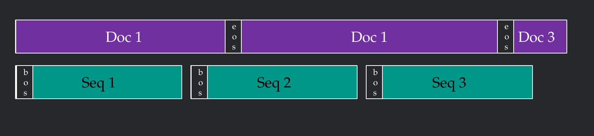
将文本切成每个有1024tokens的序列，实际上有效只有1023，因为bos和eos只是用来提示开始和结束的

## Default objective {#default-objective}


$$
\begin{aligned}
Q_\theta(x) &= \prod_i Q_\theta(x_i \mid x_{<i}) \\
L(\theta) &= \mathbb{E}_{x \sim P}\left[-\log Q_\theta(x)\right] \\
&= \mathbb{E}_{x \sim P}\left[-\sum_i \log Q_\theta(x_i \mid x_{<i})\right]
\end{aligned}
$$


上面的数学公式展示了构建loss function的过程：基于前文的每一个token预测下一个token准确的概率乘积，Loss就是取其负对数，按长度取平均。

## Optimization {#optimization}
 common workflow
```python
input_ids = train_batches[batch_idx]
loss = training_loss(input_ids)
loss = loss / config.num_micro_batches
loss.backward()
optimizer.step()
```

关于[学习率调度](../DL-ZJU/Lecture4%20%E6%8F%90%E5%8D%87CNN%E7%9A%84%E5%87%86%E7%A1%AE%E6%80%A7.md#%E5%AD%A6%E4%B9%A0%E7%8E%87%E8%B0%83%E5%BA%A6)和[优化器调整](../DL-ZJU/Lecture4%20%E6%8F%90%E5%8D%87CNN%E7%9A%84%E5%87%86%E7%A1%AE%E6%80%A7.md#%E4%BC%98%E5%8C%96%E5%99%A8%E8%B0%83%E6%95%B4)，DL-ZJU中已经有详细介绍，所以在这里就先介绍一下其中没有的部分

默认情况下，学习率使用linear learning rate decay: warm up for first 1%, then linear

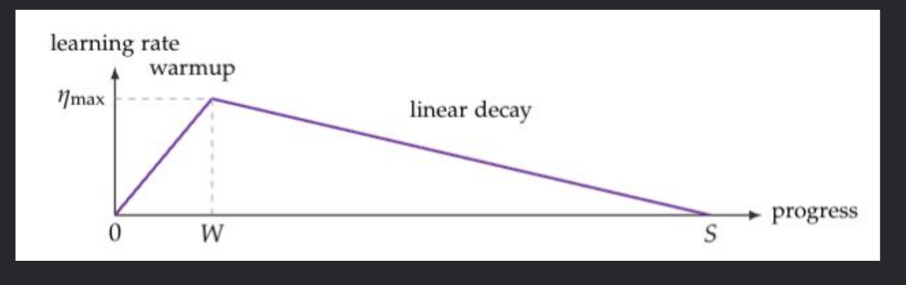

对于优化器，weight decay在Adam的基础上在参数前加上了系数，将参数拉向0

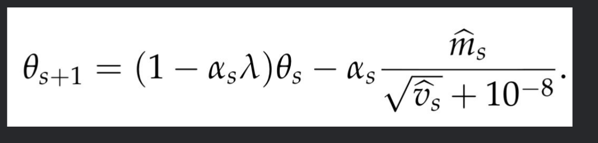

梯度裁剪，限制梯度的大小
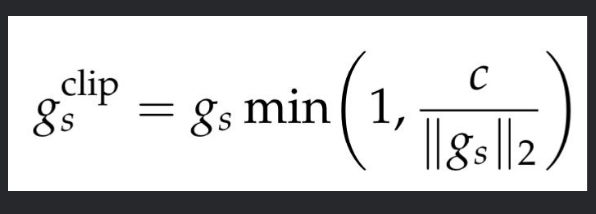

## Architecture {#architecture}
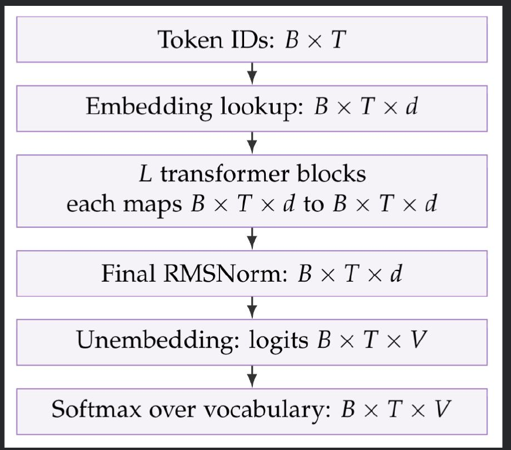
transformer的输入与输出维度相同，所以可以叠加多层
### Embedding layer {#embedding-layer}
原本一个batch有B个序列，每个序列有T个token，在长度为V的词表中查询，每个token嵌入d维的one-hot隐藏向量


 ***分割线，下面是一个transformer block的结构***
---
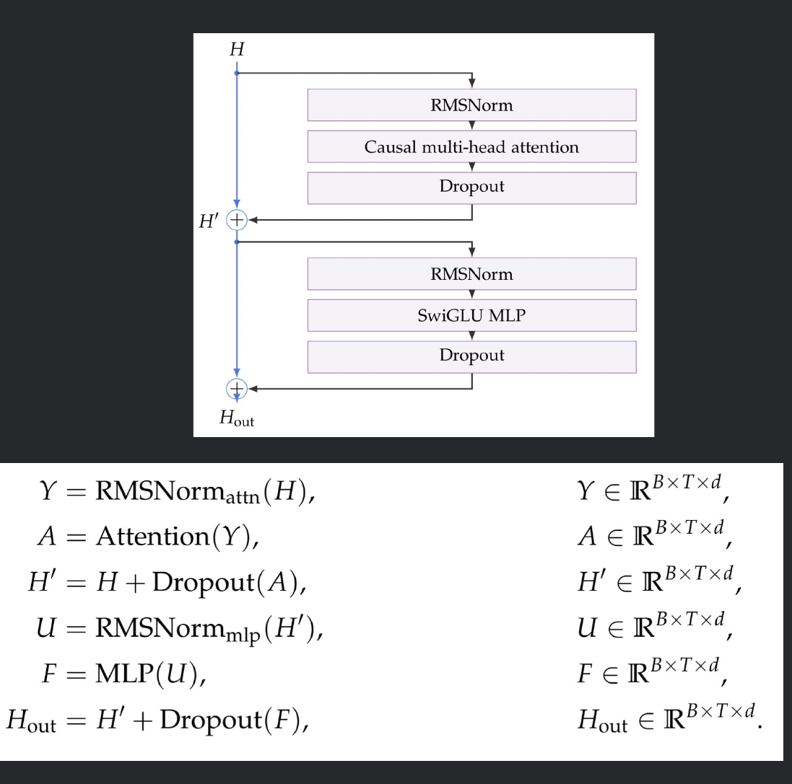

### RMSNorm {#rmsnorm}
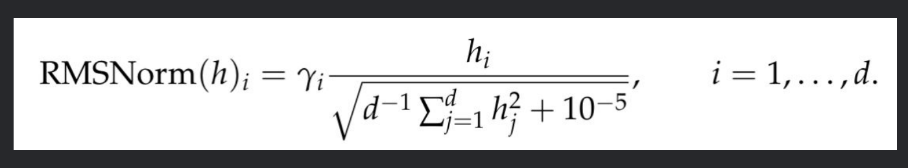
在MLP和attention之前使用，所以叫做prenorm

在注意力中使用norm就是QK Norm，（差求不多吧，~~反正哪里要是防爆炸放消失就norm一下~~

### Attention {#attention}
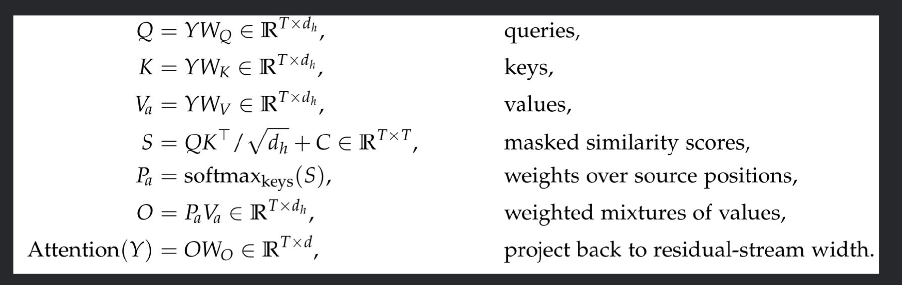

这部分是重点，训练三个矩阵，与$Y$相乘得到三个不同角度的投射，一个注意力头是$d_h$维。$C$为mask，遮住未来信息。$W_O$是Jacob矩阵，将结果重新投射回$d$维。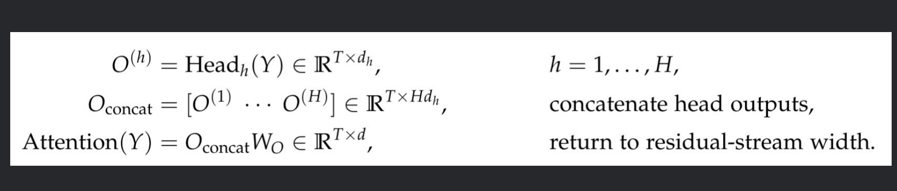

对于多头注意力，每个头都有前文的所有信息，但是却又不同的训练矩阵，这意味着模型可以从不同的角度注意到前文，比如一个关注动词，一个关注名词（这当然是一种”比喻“，模型的感知很难反推）。拼接所有的attention后再投射回原有空间。也不是注意力头越多越好，这样会稀释每个的维度。


!!! question
    从QKV计算上的分工，是如何描述出它们注意力的语义的，使用不同的结构可以吗


### RoPE {#rope}
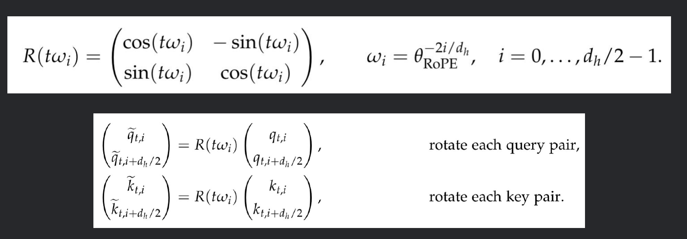
对$Q$和$K$做旋转操作，让注意力头知道不同的token的距离，it's the math thing

### MLP {#mlp}
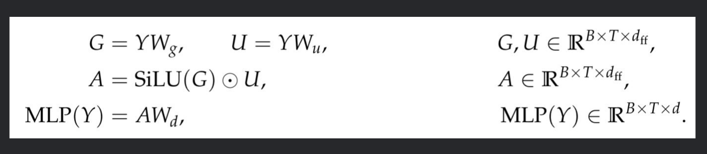
 在每个位置内部非线性变换特征，有很多种方式，图中展示的是SwiGLU的方式
---

### Unembedding {#unembedding}
通过激活函数softmax输出词表中的概率

### 残差连接 {#残差连接}
$x\mapsto x+f(x)$
在f学习不好的情况下，保证x有原始通路，梯度路径更直接
但是只有输入输出维度相同时可以用

## Initialization {#initialization}

通过高斯分布特征来初始化参数


!!! question
    具体每个参数的初始化特征不同，这涉及很多数学推导，所以暂时没有关注
