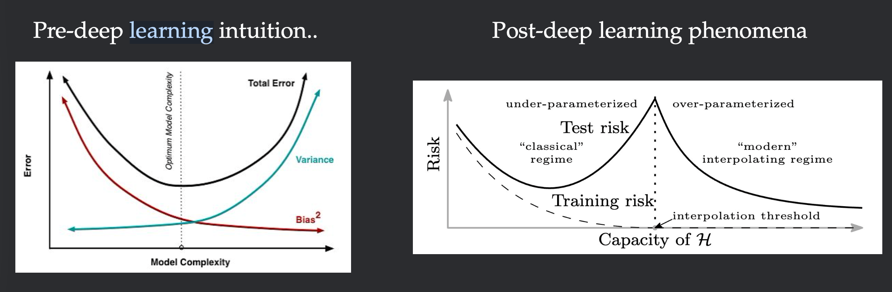
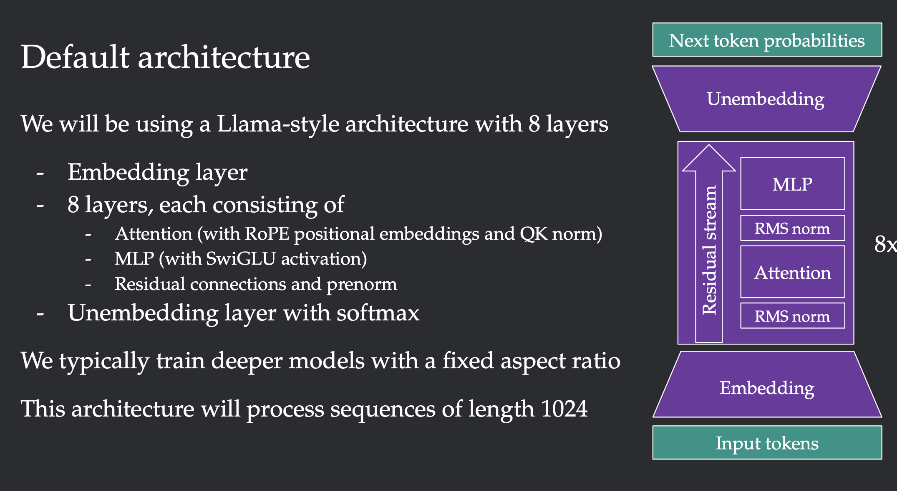

!!! intro
    深度学习里，怎样的直觉靠的住？这是贯穿整个课程的理念，它希望我们通过实验来确定。

## why alchemy {#why-alchemy}

最开始，根据偏差-方差图（这里的方差是不同的数据集得到的模型表现），参数过少，模型欠拟合；参数过多，过拟合。偏差和方差成反向变化

但是，当模型过于over-parameterized，模型表现又遂参数变多而变好。

...but these phenomena are brittle! “合理“使用不同的训练方案，才会使loss随参数增加而下降。若”不合理“，可能会适得其反。

这里的”合理“与”不合理“，就是alchemy试图教会我们的，它依赖实验经验，却没有通用理论（深度学习的不可解释性）。

!!! question
    深度学习真的不可解释吗？前沿的paper又有哪些research

    [!quote] 
    No general theory of deep learning (yet). Intuition and trial-and-error dominate. Teaching (and research) often does not reflect this reality 

## default model {#default-model}
我们主要关注的是pre-training，以训练一个Llama-style的语言模型为例，data-architecture-objective-optimization

$$
\begin{aligned}
Q_\theta(x) &= \prod_i Q_\theta(x_i \mid x_{<i}) \\
L(\theta) &= \mathbb{E}_{x \sim P}\left[-\log Q_\theta(x)\right] \\
&= \mathbb{E}_{x \sim P}\left[-\sum_i \log Q_\theta(x_i \mid x_{<i})\right]
\end{aligned}
$$

上面的数学公式展示了构建loss function的过程：基于前文的每一个token预测下一个token准确的概率乘积，Loss就是取其负对数，按长度取平均。

~~具体的模型结构会在下一个补充的lec涉及，绝不是因为我还没有完全懂~~

---
 分割线，下面是对结构的剖析

MLP以SwiGLU作为激活函数

prenorm即是表明归一化发生在MLP和Attention之前

 只做 Attention 时，模型本身不知道 token 的相对位置。RoPE 会根据位置旋转 $Q$ 和 $K$ 向量，使它们的点积包含相对位置信息。
。。。

--- 

对于优化，选择合适的优化器和学习率以及一些正则化方法，在ZJU的深度学习基础中已有涉及

data很有意思，先人工清洗，筛掉一半左右的数据，然后是去重。最后是model-based filtering。

!!! question
    清洗的model是如何训练出来，它为什么要放在最后一步

## two example questions {#two-example-questions}

to be done 
code过会再阅读吧
