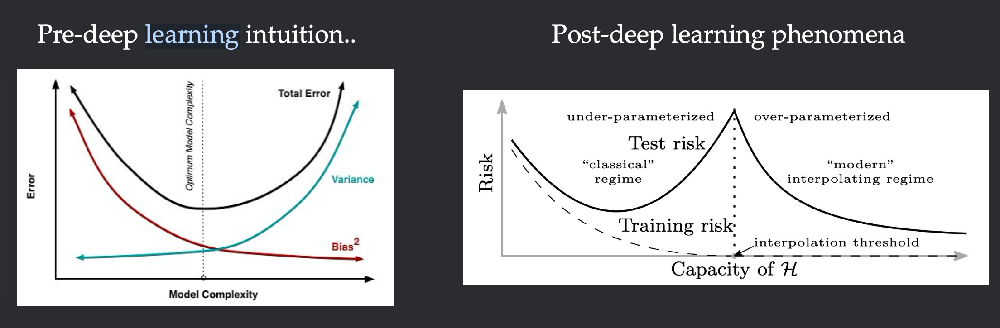
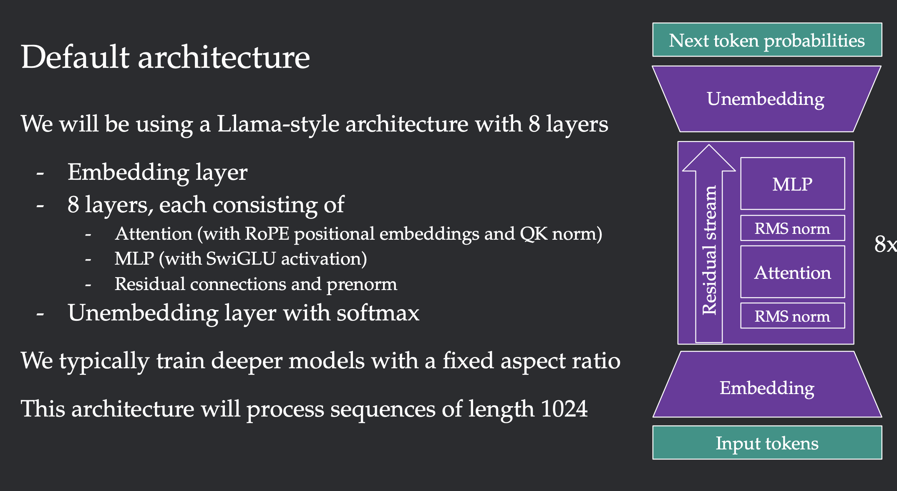

!!! intro
    深度学习里，怎样的直觉靠的住？这是贯穿整个课程的理念，它希望我们通过实验来确定。

## why alchemy {#why-alchemy}

最开始，根据偏差-方差图（这里的方差是不同的数据集得到的模型表现），参数过少，模型欠拟合；参数过多，过拟合。偏差和方差成反向变化

但是，当模型过于over-parameterized，模型表现又遂参数变多而变好。

...but these phenomena are brittle! “合理“使用不同的训练方案，才会使loss随参数增加而下降。若”不合理“，可能会适得其反。

这里的”合理“与”不合理“，就是alchemy试图教会我们的，它依赖实验经验，却没有通用理论（深度学习的不可解释性）。

!!! question
    深度学习真的不可解释吗？前沿的paper又有哪些research

!!! quote
    No general theory of deep learning (yet). Intuition and trial-and-error dominate. Teaching (and research) often does not reflect this reality 

## default model {#default-model}
我们主要关注的是pre-training，以训练一个Llama-style的语言模型为例，data-architecture-objective-optimization

~~具体的模型结构会在下一个补充的lec涉及，绝不是因为我还没有完全懂~~

对于优化，选择合适的优化器和学习率以及一些正则化方法，在ZJU的深度学习基础中已有涉及

data很有意思，先人工清洗，筛掉一半左右的数据，然后是去重。最后是model-based filtering。

!!! question
    清洗的model是如何训练出来，它为什么要放在最后一步

## two example questions {#two-example-questions}

to be done 
code过会再阅读吧
