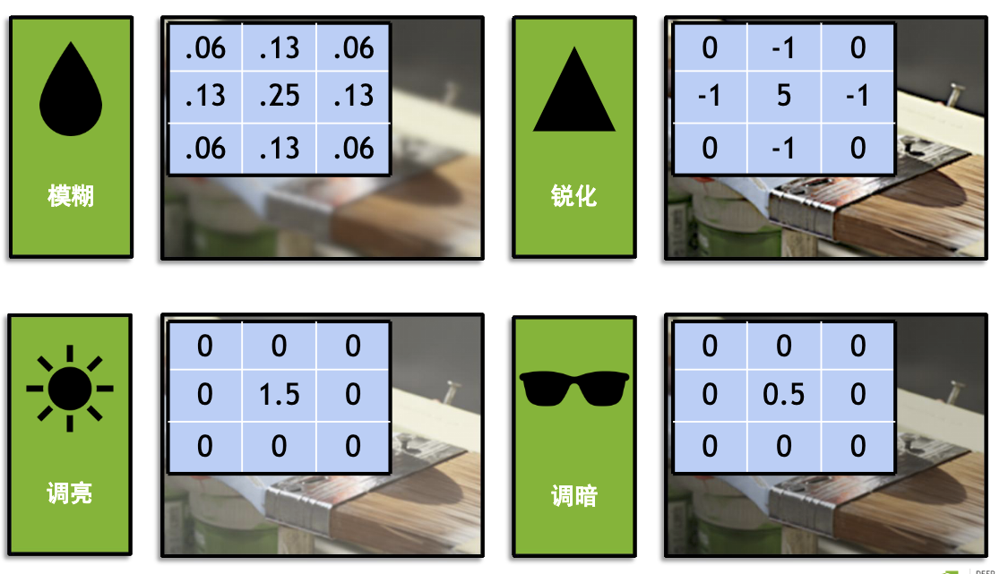
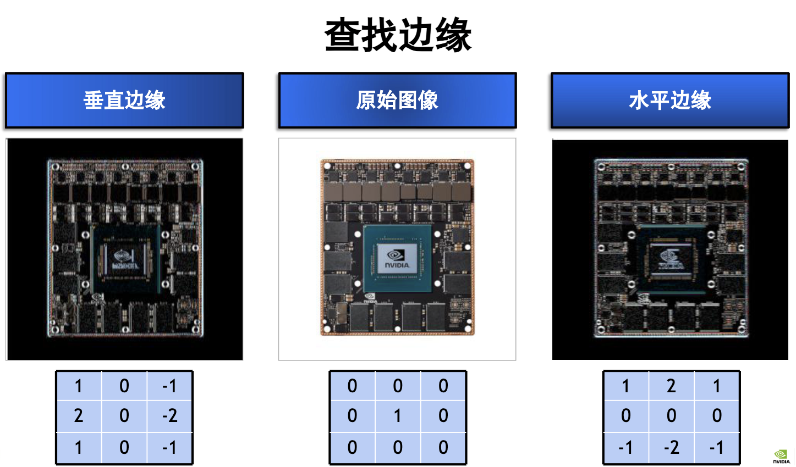

# Lecture3 卷积神经网络CNN {#lecture3-卷积神经网络cnn}


!!! note
    我们在lab2使用了全连接神经网络训练了一个识别美国手语的模型。可是这个模型train准确率高，验证准确率低，这是明显的过拟合现象。因为我们把图片转换成了一个一维向量，为了保留图片的空间信息，引入卷积神经网络CNN。


## 内核和卷积 {#内核和卷积}
内核是一个矩阵，卷积是内核在空间上以一定的步长进行的加权运算。我们通常称”xD-CNN“，这里的x就是指在x维的空间卷积。


!!! tip
    既然1D可以直接展平成一维向量，为什么还要1D-CNN呢？
    对于普通的表格特征，确实不需要，但是如果是一个代表顺序的位置轴，如音频，他们的位置信息就需要CNN。


$Y(i,j)=\sum_u\sum_v K(u,v)X(i+u,j+v)$


!!! note
    内核通常是3x3?
    参数量少、可以通过多层的叠加得到更大的感受野、两个3x3可以有两次非线性、奇数尺寸更好保持图像大小


### 图像处理 {#图像处理}
> 模糊，权重都是正数且总和为 1，相当于取邻域平均
> 高斯模糊，仍然是平均，但中心像素权重更大，因此比普通均值模糊自然。
> 边缘检测，卷积核权重总和通常为 0。颜色相同的区域结果接近 0，只有亮度突然变化的位置产生较大结果。


显然，图中的模糊为高斯模糊


### 填充 {#填充}
因为进行卷积运算后，图像尺寸会越来越小，所以我们要进行填充操作。

Zero Padding，就是在图像周围补零，但这样边缘可能因此出现边界效应。

复制边缘填充 Replicate Padding，把最边缘的像素不断向外复制，适合边缘恒定的图片，可能会影响边缘检测

镜像填充 Reflect Padding，将图像内部内容沿边界反射，并且通常不重复边缘像素，如：
```text
原图：            a  b  c  d
镜像扩展：   c  b | a  b  c  d | c  b
```
对称填充 Symmetric Padding,与镜像填充相似，但会重复边缘像素：
```text
Reflect：    c b | a b c d | c b
Symmetric：  b a | a b c d | d c
```

循环填充 Circular Padding，适合周期性和环形数据
$c,d\mid a,b,c,d\mid a,b$


!!! note "填充尺寸"
    若要达到相同填充，即$H_{\text{out}}=H_{\text{in}},\qquad W_{\text{out}}=W_{\text{in}}$
    当步长 $S=1$、卷积核大小为奇数 $K$ 时，每侧需要填充：


    $$
    P=\frac{K-1}{2}
    $$


    普通二维卷积的单个方向尺寸为：


    $$
    H_{\text{out}}
    =
    \left\lfloor
    \frac{H_{\text{in}}+2P-K}{S}
    \right\rfloor+1
    $$


## CNN网络结构 {#cnn网络结构}

CNN 用于图像分类时，经典层结构可以概括为：


$$
\boxed{
\text{输入}
\rightarrow
[\text{卷积}\rightarrow\text{激活}\rightarrow\text{下采样}]^N
\rightarrow
\text{特征汇总}
\rightarrow
\text{全连接}
\rightarrow
\text{输出}
}
$$


这是最基本的结构，`Dropout`、`BN`等层详见下一章

### 输入层 {#输入层}
$B\times C\times H\times W$，其中 $B$ 是批量大小，$C$ 是通道数。

### 卷积层 Conv {#卷积层-conv}
 > 卷积核就是一组局部连接、可以训练并且会在整张图像上共享的神经网络权重。
 >只不过，相比于全连接神经网络，卷积核是一个”局部神经元“，并且移动时使用同一个权重。

 卷积核形状
 $(K_h,K_w,C_{\text{in}},C_{\text{out}})$，输入通道表示“当前已经有哪些特征”，输出通道表示“这一层准备提取多少种新的特征”，越往后输出通道越多。

### 激活层 {#激活层}
激活函数通常使用$\operatorname{ReLU}(x)=\max(0,x)$

### 下采样层 subsampling {#下采样层-subsampling}
使图片变得更小，处理参数变得更小，扩大感受野，保留更重要的特征

#### 最大池化 Max Pooling {#最大池化-max-pooling}
在一个局部区域中保留最大值
保留局部响应最强的特征

如使用 $2\times2$ 池化核、步长为 2：


$$
28\times28\rightarrow14\times14
$$


#### 平均池化 Average Pooling {#平均池化-average-pooling}
计算局部区域的平均值
比MaxPooling更加平滑，但是强特征可能被稀释

#### 步长卷积 Strided Convolution {#步长卷积-strided-convolution}
通常我们的步长设置为1，但是如果我们的步长设置为2，卷积后就会有尺寸大致减半的效果
它比较特殊的是在下采样的过程中可以提取特征，有可以学习的参数，所以现代CNN经常使用
$\text{Conv(stride=2)}$

#### 自适应池化 Adaptive Pooling {#自适应池化-adaptive-pooling}
图像输入尺寸不固定，但我们固定了输出尺寸，它会自动计算池化核和步长

#### 全局平均池化 Global Average Pooling {#全局平均池化-global-average-pooling}
把每张特征图的所有位置取平均，最终通道只保留一个数


$$
C\times H\times W
\rightarrow
C\times1\times1
$$


- 可以使 Flatten 后的全连接层变小，从而减少过拟合
- 常用于 CNN 的分类头。


!!! tip
    可以把 CNN 分成两部分：


    $$
    \boxed{
    \text{Backbone 特征提取器}
    +
    \text{Classification Head 分类头}
    }
    $$


    前半部分：


    $$
    \text{Image}
    \rightarrow
    \text{Conv}
    \rightarrow
    \text{Conv}
    \rightarrow\cdots
    \rightarrow
    512\times7\times7
    $$


    负责把原始像素变成高级语义特征。

    后面的：


    $$
    512\times7\times7
    \xrightarrow{\text{GAP}}
    512
    \xrightarrow{\text{Linear}}
    1000
    $$


    负责根据这些特征做最终分类，这部分就叫 **classification head**。


#### 抗混叠采样 {#抗混叠采样}
值得注意的是，以上方法有一个问题：假设图片中有黑白相间的条纹，经过步长为2的池化后可能变成全白或全黑。高频纹理被错误地转换成了低频信息，这种现象叫作**混叠 Aliasing**。

引入抗混叠采样，我们需要先低通滤波，再普通下采样


$$
y[m,n]=(x*h)[sm,sn]
$$


- $h$：模糊或低通滤波核；
- $s$：下采样倍数；
- $x*h$：先对图像进行平滑；

**Blur Pooling** 是实现抗混叠下采样的一种方法：


$$
\boxed{\text{特征提取}\rightarrow\text{模糊}\rightarrow\text{下采样}}
$$


例如普通最大池化是：


$$
\operatorname{MaxPool}(kernel=2,stride=2)
$$


Blur Pooling 可以拆成：


$$
\operatorname{MaxPool}(kernel=2,stride=1)
\rightarrow
\operatorname{Blur}
\rightarrow
\operatorname{Subsample}(stride=2)
$$


 常见二项式模糊核


$$
\frac{1}{4}
\begin{bmatrix}
1&2&1
\end{bmatrix}
$$


$$
\frac{1}{16}
\begin{bmatrix}
1&2&1\\
2&4&2\\
1&2&1
\end{bmatrix}
$$


它和高斯模糊类似：中心位置权重较高，附近位置权重较低。这个模糊核通常是固定的，不参与训练。


!!! tip
    Blur Pooling不就是要先做一层卷积吗，这不是和步长卷积的步骤一样吗？
    并非，步长卷积核是为了学习特征，而Blur Pooling的卷积核是为了滤波，而且参数也不能训练，所以可以使用$Conv(stride=1) → Blur(stride=2)$或$x \rightarrow \operatorname{Blur}(x) \rightarrow \operatorname{Conv}(stride=2)$，先卷积再模糊。


## CNN特征可视化 {#cnn特征可视化}

> 这是理解CNN的一种方法，固定模型，反过来修改输入图像，使某个神经元的输出尽可能大，又称激活最大化。相当于“逆运算”

把整张特征图求和


$$
A^k(x)=\sum_{i=1}^{11}\sum_{j=1}^{11}a^k_{ij}
$$


然后寻找一张图像，能让第 $k$ 个卷积核在所有位置上的总激活最大


$$
x^*=\arg\max_x A^k(x)
$$


使用梯度上升


$$
x_{t+1}=x_t+\eta\nabla_x A^k(x_t)
$$


!!! tip
    为什么使用梯度上升？
    因为要目标变量越大越好，而训练网络时Loss越小越好，所以用梯度下降


值得注意的是，当我们选择输出神经元激活最大化时，并不会出现原有的图片，因为梯度上升可能找到一种人看起来毫无意义、但能够强烈刺激网络的高频纹理。这不代表CNN什么都没有学到，而是“让分类分数最高”和“让图像看起来最像”不是同一个目标。

### 加入像素惩罚 {#加入像素惩罚}
为减少噪声，在目标函数中减去所有像素绝对值之和


$$
x^*
=
\arg\max_x
\left[
y^i(x)-\sum_{i,j}|x_{ij}|
\right]
$$


## CNN相关应用 {#cnn相关应用}

### 图像分类 {#图像分类}
Lenet - AlexNet - VGGNet(证明了网络深度可以提高模型的表现)

### 脸部识别 {#脸部识别}

!!! tip
    CNN本质是提取类似特征，图像分类的“分类”二字就代表着边界是预先规定的，所以当我们要识别一个完全不属于模型的东西时，要重新训练。但是，如果我们要训练门禁，遇到一个新的人脸需要录入，不用重新训练模型，而是通过将其转化为`embedding`，以欧氏距离来判断两张脸像不像。前者是判断，后者是比较。

#### 早期 {#早期}
不同于CNN，它的特征提取是实现规定好的，不能学习，所以无法识别面部特征


$$
\text{图片}\xrightarrow{\text{HOG}}\text{人工特征}
\xrightarrow{\text{SVM}}\text{人脸/非人脸}
$$


#### AR人脸技术 {#ar人脸技术}
第一步是BlazeFace，快速找到人脸框，受MobileNet、SSD启发，可以实时运行，并适配轻量化设备。

第二步是特征点检测，先用CNN模型的2D-HeatMap(可信点可以优化预测)找到若干个关键点。事先我们准备了一个标准的人脸3D模型，它有$\Phi=(\text{位置},\text{旋转},\text{脸型},\text{表情...})$的参数，将3D投影到2D，通过梯度下降调整$\Phi$，实现3D识别的效果。

当然也可以使用Attention Mesh，通过注意力机制提高特定区域的坐标识别精度。


### 目标检测 {#目标检测}

还要回答”在哪里？“
因此，每个检测结果通常包含：


$$
(\text{类别},\ \text{置信度},\ x,\ y,\ w,\ h)
$$


#### One-Stage {#one-stage}
直接在图片上预测，速度快，如YOLO、SSD。

#### Two-Stage {#two-stage}
先生成候选区域，然后再回归

这一部分可挖掘的还有很多，详见PPT65-81

### 图像分割 {#图像分割}
详见PPT83-90
