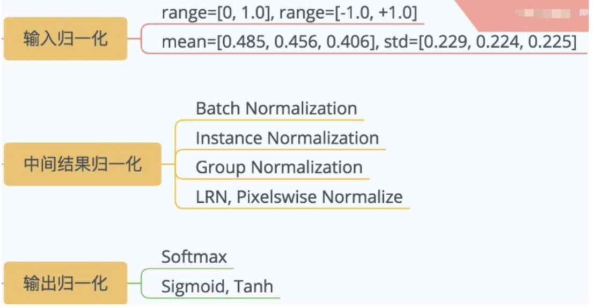
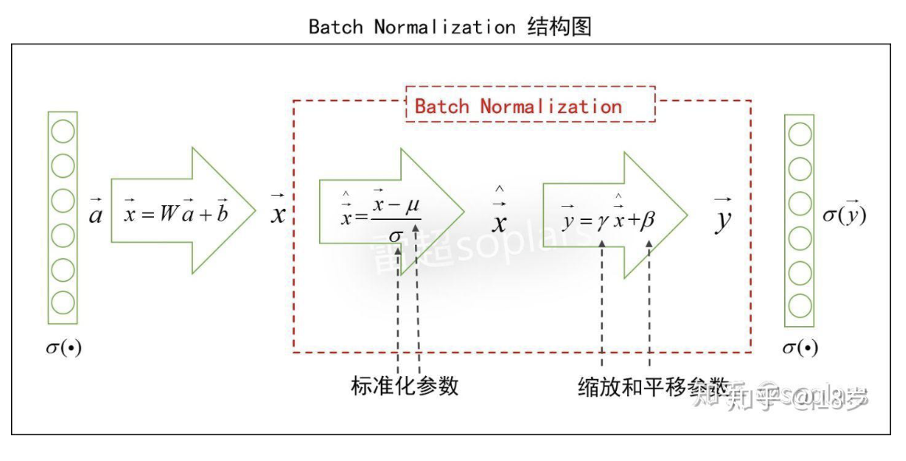
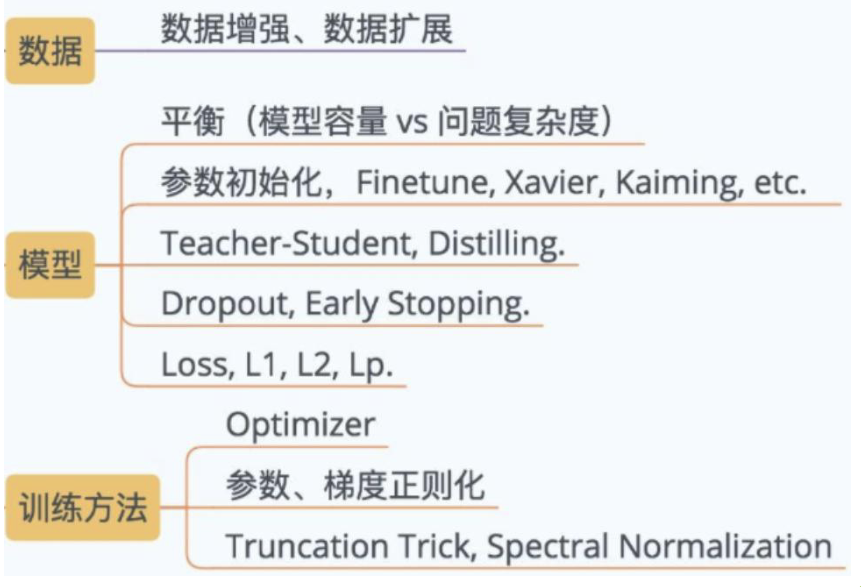

# Lecture4 提升CNN的准确性 {#lecture4-提升cnn的准确性}

## 数据增强 {#数据增强}


!!! intro "为什么需要数据增强"
    我们可以通过对数据合理的变换，模拟真实的数据分布，将已有的先验知识注入模型，使模型的训练更有效率。但并非所有的变换都合理，如6和9的上下翻转，因为发生变化后答案也变了。

    本文我们主要讨论二维图像的数据增强。图像是三维场景的一个二维投射，一个场景的每一张图片都是这个随机变量的一个采样，它们共同构成了它的样本空间


### 有监督的样本数据增强 {#有监督的样本数据增强}
- 几何变化类：旋转、翻转、裁剪、变形、缩放...
- 颜色变换类：噪声、模糊、擦除、填充、颜色扰动、亮度、通道偏移...

### 无监督样本数据增强 {#无监督样本数据增强}
通过模型学习数据的分布，随机生成与训练集分布一致的图片，如GAN、DCGAN(这些会在lecture7中详细介绍)


$$
z\sim p(z),\qquad x'=G(z)
$$


模型从随机噪声 $z$ 出发，直接生成一张新图片。它需要先从大量真实图片中学习近似的数据分布


$$
p_G(x)\approx p_{\text{data}}(x)
$$


## 归一化 Normalization {#归一化-normalization}

归一化的目的是使数据和特征准确表达、便于处理


### 批量归一化 Batch Normalization {#批量归一化-batch-normalization}

!!! intro
    训练神经网络时，前面的层参数发生变化会导致每层输入的分布在训练过程中会发生变化，导致模型需要较低的学习率和非常谨慎的参数初始化策略，这种现象叫`内部协变量转移(Internal Covariate Shift)`，BN就是用来解决这个问题


 

- 有助于激活函数进行非线性化
- 均值为0，方差为1，加快收敛速度
- 防止过拟合，将一个batch的数据关联在一起
- 防止梯度爆炸和梯度消失


## 正则化 Regularization {#正则化-regularization}
 正则化旨在减少泛化误差，通过在训练时引入一些惩罚，减少过拟合的风险


从图中可以看出，正则化的广义定义包括很多，上文的归一化也可以被看做一种正则化方法。


!!! tip
    - 训练误差是模型在训练集上的平均错误，L是损失函数


    $$
    \hat{R}_{train}(f)
    =
    \frac{1}{n}\sum_{i=1}^{n} L(f(x_i),y_i)
    $$


    - 泛化误差是模型面对从真实数据分布中重新抽取的、未见过的数据时，预期产生的错误


    $$
    R(f)
    =
    \mathbb{E}_{(x,y)\sim P_{\text{data}}}
    [L(f(x),y)]
    $$


    但真实的数据分布 $P_{\text{data}}$ 通常未知，所以无法精确计算。实际中使用独立测试集上的误差来近似


    - 泛化间隙

    训练误差和泛化误差之差：


    $$
    \text{Generalization Gap}
    =
    R(f)-\hat{R}_{train}(f)
    $$


### L1正则化 Lasso {#l1正则化-lasso}
在损失函数中加入所有模型参数的绝对值之和（L1范数），使模型更倾向于产生稀疏权重矩阵。

### L2正则化 Ridge {#l2正则化-ridge}
在损失函数中加入权重向量的平方和（L2范数），使权重变得更小，有助于平滑模型

### 学习率调度 {#学习率调度}
- 固定步长衰减。如：每过10个epoch，学习率减半
- 指数衰减 $\eta_t=\eta_0\gamma^{t/s}$
- 余弦退火，按照半个余弦曲线降低学习率


$$
\eta_t
=
\eta_{\min}
+
\frac{1}{2}
(\eta_0-\eta_{\min})
\left(
1+\cos\frac{\pi t}{T}
\right)
$$


### Dropout {#dropout}
Dropout 是一种防止神经网络过拟合的正则化方法，通过关闭部分神经元来迫使网络不过渡依赖某几个特征。训练时开启，预测时关闭。（特殊的Monte Carlo Dropout使用预测的Dropout来估计模型的不确定性）


$$y=\frac{m\odot x}{1-p}$$


p为神经元被关闭的概率，除以1-p是为了保持期望不变
m是Dropout产生的掩码


!!! important "Dropout位置"

    ```text
    Conv → BatchNorm → ReLU → Dropout2d → Pool
    ```
    ```text
    Linear → ReLU → Dropout → Linear
    ```
    前者关闭通道；后者关闭神经元，更常见。总之都在激活层之后


### 优化器调整 {#优化器调整}


!!! hint
    如果说学习率调度是调整步长，那么优化器调整就是


优化器根据损失函数的梯度更新模型参数。设第 $t$ 次更新时，参数为 $\theta_t$，当前 mini-batch 计算出的梯度为


$$
g_t=\nabla_{\theta}L_{\mathcal B_t}(\theta_t)
$$


学习率决定每次更新的整体步长，优化器决定如何利用当前梯度以及历史梯度。

#### 随机梯度下降 SGD {#随机梯度下降-sgd}


$$
\theta_{t+1}=\theta_t-\eta g_t
$$


- $\eta$ 是学习率。过大容易越过最低点、震荡甚至发散；过小则收敛缓慢。
- batch size 会影响梯度估计的噪声。小批量梯度波动更大，单次计算量较小；大批量梯度更稳定，但消耗更多显存。
- SGD 只使用当前梯度，不保存此前的移动方向。


!!! note
    讲义用“容易陷入局部最优”概括 SGD 的困难。在高维神经网络中，实际还经常遇到鞍点、狭长谷底中的震荡，以及不同方向梯度尺度差异很大的问题。


```python
optimizer = keras.optimizers.SGD(
    learning_rate=0.01,
    momentum=0.0,
)
```

#### 带动量的随机梯度下降 SGDM {#带动量的随机梯度下降-sgdm}

Momentum 在 SGD 上增加“惯性”，利用历史更新方向加速收敛并减少震荡：


$$
v_t=\mu v_{t-1}-\eta g_t
$$


$$
\theta_{t+1}=\theta_t+v_t
$$


- $v_t$ 是当前更新速度。
- $\mu$ 是动量系数，常用值为 $0.9$。
- 当连续多个梯度方向一致时，更新会加速；当梯度横向来回变化时，不同方向会互相抵消。

```python
optimizer = keras.optimizers.SGD(
    learning_rate=0.01,
    momentum=0.9,
)
```

#### RMSprop {#rmsprop}

RMSprop 为每个参数维护梯度平方的指数加权移动平均：


$$
s_t=\rho s_{t-1}+(1-\rho)g_t^2
$$


$$
\theta_{t+1}
=
\theta_t-
\eta\frac{g_t}{\sqrt{s_t}+\varepsilon}
$$


因此每个参数的有效学习率不同：梯度长期较大的方向会缩小步长，梯度长期较小的方向会获得相对更大的步长。

- 衰减率 $\rho$ 常取 $0.9\sim0.99$，控制保留多少历史梯度平方信息。
- 学习率常从 $0.001$ 开始尝试。
- $\varepsilon$ 是防止除零的小常数。

```python
optimizer = keras.optimizers.RMSprop(
    learning_rate=0.001,
    rho=0.9,
    epsilon=1e-7,
)
```

#### Adam（Adaptive Moment Estimation） {#adamadaptive-moment-estimation}

Adam 同时结合了 Momentum 和 RMSprop 的思想，分别维护梯度和梯度平方的移动平均：


$$
m_t=\beta_1m_{t-1}+(1-\beta_1)g_t
$$


$$
v_t=\beta_2v_{t-1}+(1-\beta_2)g_t^2
$$


训练初期两个移动平均都偏向于零，因此需要进行偏差修正：


$$
\hat m_t=\frac{m_t}{1-\beta_1^t},
\qquad
\hat v_t=\frac{v_t}{1-\beta_2^t}
$$


最终更新为：


$$
\theta_{t+1}
=
\theta_t-
\eta\frac{\hat m_t}{\sqrt{\hat v_t}+\varepsilon}
$$


常见默认值为 $\beta_1=0.9$、$\beta_2=0.999$、$\eta=0.001$。讲义中的 Keras 默认 $\varepsilon=10^{-7}$；不同框架的默认值可能不同。

```python
optimizer = keras.optimizers.Adam(
    learning_rate=0.001,
    beta_1=0.9,
    beta_2=0.999,
    epsilon=1e-7,
)
```

| 优化器 | 使用当前梯度 | 积累历史方向 | 按参数调整步长 |
| --- | --- | --- | --- |
| SGD | 是 | 否 | 否 |
| SGDM | 是 | 是 | 否 |
| RMSprop | 是 | 否 | 是 |
| Adam | 是 | 是 | 是 |


!!! summary
    SGD 看当前坡度；SGDM 带着惯性前进；RMSprop 为不同方向调整步长；Adam 同时使用惯性和自适应步长。优化器还可以与前面的学习率调度组合，例如 SGDM + Step Decay 或 Adam + Cosine Decay。


## 标签平滑 Label Smoothing {#标签平滑-label-smoothing}

独热标签把正确类别设为 $1$，其余类别全部设为 $0$。例如四分类中的 dog：


$$
y=[1,0,0,0]
$$


交叉熵会推动模型不断增大正确类别与其他类别之间的 logit 差距。若要求 softmax 概率严格达到 $1$ 和 $0$，理论上需要无限大的 logit 差距，因此模型容易形成过度自信的预测。

标签平滑将 hard label 改为 soft label。讲义采用“把 $\varepsilon$ 分给其余 $K-1$ 类”的形式：


$$
y'_i=
\begin{cases}
1-\varepsilon, & i=z\\
\dfrac{\varepsilon}{K-1}, & i\ne z
\end{cases}
$$


当 $K=4$、$\varepsilon=0.1$ 时：


$$
[1,0,0,0]
\longrightarrow
[0.9,0.0333,0.0333,0.0333]
$$


这样做会限制模型对训练样本过度自信，是一种通过修改监督信号实现的正则化方法，通常有助于泛化。


!!! warning "两种常见定义"
    讲义公式的分母写成“总类别数”，但示例数值对应的是 $K-1$。另一种常见实现是


    $$
    y'=(1-\varepsilon)y+\frac{\varepsilon}{K}\mathbf 1
    $$


    此时正确类为 $1-\varepsilon+\varepsilon/K$，其余类为 $\varepsilon/K$。使用框架时应以该框架的定义为准。


## 焦点损失 Focal Loss {#焦点损失-focal-loss}

Focal Loss 主要用于解决密集目标检测中的类别不平衡问题。在一张图像中，能够匹配目标的正样本候选框可能只有几十个，而背景负样本可能达到 $10^4\sim10^5$ 个。大量容易分类的背景样本会主导总损失和梯度，使少数困难样本被淹没。

对于二分类，设模型预测前景的概率为 $p$，定义模型赋给真实类别的概率：


$$
p_t=
\begin{cases}
p, & y=1\\
1-p, & y=-1
\end{cases}
$$


普通交叉熵为：


$$
CE(p_t)=-\log(p_t)
$$


Focal Loss 在其前面增加调制因子：


$$
FL(p_t)
=
-\alpha_t(1-p_t)^\gamma\log(p_t)
$$


- $\alpha_t$：调整不同类别的权重，缓解正负样本数量不平衡。
- $\gamma$：控制对简单样本的抑制程度，常见选择为 $2$。
- 当 $\gamma=0$ 时，Focal Loss 退化为带类别权重的交叉熵。

当 $p_t\to1$ 时，样本已经被正确且自信地分类：


$$
(1-p_t)^\gamma\to0
$$


它对总损失的贡献被显著降低。当 $p_t$ 很小时，说明样本较难或被错误分类，调制因子接近 $1$，其损失基本被保留。因此训练会把更多注意力放在困难样本上。

例如 $\gamma=2$ 时：

- 易样本 $p_t=0.9$：调制因子为 $(1-0.9)^2=0.01$。
- 难样本 $p_t=0.1$：调制因子为 $(1-0.1)^2=0.81$。

## 多尺度特征融合 Multi-scale Feature Fusion {#多尺度特征融合-multi-scale-feature-fusion}

不同网络层包含的信息不同：

- 浅层特征图分辨率高，保留边缘、纹理和小目标位置等细节，但语义较弱。
- 深层特征图分辨率低，感受野更大、语义更强，但空间细节减少。

多尺度特征融合把不同层次或不同感受野的特征组合起来，使模型能够同时识别大小不同的物体。

### 空间金字塔池化 SPP {#空间金字塔池化-spp}

Spatial Pyramid Pooling 在同一张特征图上使用多个尺度的池化网格，再拼接成固定长度的表示。它可以获得不同尺度的上下文，并减少输入图像必须固定尺寸的限制，最初用于图像分类。

### 特征金字塔网络 FPN {#特征金字塔网络-fpn}

Feature Pyramid Network 在自底向上的 CNN 特征之外，增加自顶向下路径和横向连接：

- 深层特征向上传递较强的语义信息；
- 与分辨率更高的浅层特征融合；
- 在多个尺度上分别进行预测。

FPN 常用于目标检测，尤其有助于检测小目标。讲义还列举了显著目标检测中的 Short Connections，它同样通过短连接组合多层特征。

## 超参数优化 {#超参数优化}

模型参数由训练算法从数据中学习，例如卷积核权重；超参数则需要在训练前或训练过程中人为设定，不能通过普通反向传播直接学习。

常见超参数包括：

| 阶段 | 超参数示例 |
| --- | --- |
| 构建模型 `model.add()` | 隐藏层数、神经元数量、初始化方法、激活函数、Dropout 概率 |
| 编译模型 `model.compile()` | 损失函数、优化器、学习率、Momentum、Weight Decay |
| 训练模型 `model.fit()` | Batch Size、Epoch 数量 |

### 重要超参数 {#重要超参数}

1. **学习率**：通常是最重要的超参数，可以保持恒定、逐步降低或由 Adam、RMSprop 等方法自适应调整。
2. **Epoch 数量**：过少会欠拟合，过多可能过拟合。应观察训练集与验证集曲线，并可使用 Early Stopping。
3. **Batch Size**：讲义给出 $[16,128]$ 作为 CNN 的常见尝试范围，但最佳值取决于数据、模型、显存和优化器；它不是固定规则。
4. **激活函数**：CNN 中通常优先尝试 ReLU 及其变体，Sigmoid、Tanh 可根据任务选择。
5. **网络深度与宽度**：过少容易欠拟合；增加层数或通道数能够提高容量，但也会增加计算量和过拟合风险。
6. **权重初始化**：初始化过大或过小都可能导致梯度不稳定。ReLU 常配合 He 初始化，Sigmoid/Tanh 常配合 Xavier/Glorot 初始化。
7. **Dropout 概率**：值越大正则化越强，但过大可能导致欠拟合。$0.5$ 是全连接层中的常见起点，不是所有层的通用最优值。


!!! important "数据集边界"
    超参数必须根据验证集或交叉验证结果选择，测试集只用于最后一次无偏评估。不能反复根据测试误差选学习率、Epoch 或网络结构，否则会对测试集产生信息泄漏。


### 常见优化方法 {#常见优化方法}

1. **手动调优**：根据训练曲线和经验逐项调整，容易理解但依赖经验。
2. **网格搜索 Grid Search**：枚举预先指定的参数组合；覆盖规则，但维度增加后成本迅速上升。
3. **随机搜索 Random Search**：从参数分布中随机采样组合；在只有少数超参数真正重要时，通常比同预算的网格搜索更有效。
4. **贝叶斯优化 Bayesian Optimization**：根据已经完成的试验建立性能模型，优先尝试更有希望的组合。
5. **进化算法 Evolutionary Algorithms**：通过选择、变异等过程搜索结构或超参数。
6. **Hyperband**：给大量配置少量训练资源，尽早停止表现差的配置，再把资源分配给更有希望的配置。

推荐流程：

```text
划分训练集、验证集和测试集
        ↓
在训练集上训练候选配置
        ↓
根据验证集选择超参数
        ↓
确定配置后重新训练模型
        ↓
只在最后使用测试集进行最终评估
```

## CNN 分类经典模型 {#cnn-分类经典模型}

这些模型的演进主线可以概括为：

```text
LeNet：建立基本 CNN 范式
  ↓
AlexNet：让深层 CNN 在 ImageNet 上取得突破
  ↓
VGGNet：堆叠小卷积核来增加深度
  ↓
GoogLeNet：用 Inception 在横向融合多尺度特征
  ↓
ResNet：用残差连接训练更深的网络
  ↓
DenseNet：让各层密集连接并复用特征
```

### LeNet（1998） {#lenet1998}

LeNet 由 LeCun 等人提出，主要用于 MNIST 等手写字符识别任务。其基本结构已经包含现代 CNN 的主要组成部分：

```text
输入 → 卷积 → 下采样/池化 → 卷积 → 下采样/池化 → 全连接 → 输出
```

它奠定了“卷积提取局部特征、池化降低空间尺寸、全连接完成分类”的基本范式。原始网络使用的激活和输出设计与现代常用的 ReLU + Softmax 有所不同。

### AlexNet（2012） {#alexnet2012}

AlexNet 在 2012 年 ILSVRC 图像分类竞赛中取得突破，共有 5 个卷积层和 3 个全连接层。主要改进包括：

- 使用 ReLU 代替容易饱和的 Sigmoid，加快训练并缓解梯度消失。
- 在全连接层使用 Dropout 抑制过拟合。
- 使用平移、裁剪、翻转、亮度变化等数据增强扩大训练分布。
- 使用 Max Pooling 和 LRN；LRN 在后来的网络中已较少使用。

### VGGNet（2014） {#vggnet2014}

VGG 说明了在合理设计下增加网络深度能够提升图像识别性能。VGG16 的核心思想是连续堆叠多个 $3\times3$ 卷积核，代替 AlexNet 中较大的 $11\times11$、$5\times5$ 卷积核。

堆叠小卷积核的优点：

- 多层 $3\times3$ 卷积可以获得与较大卷积核相近的感受野。
- 在卷积之间加入更多非线性激活，提高表达能力。
- 在通道数相同的近似比较中，通常能减少参数量。

典型结构是多组 `Conv → ReLU`，每组后接 Max Pooling，最后连接全连接分类器。原始 VGG 与后来的 VGG-BN 是不同版本，讲义中的 `(BN+)` 表示可选的 BN 变体。

### GoogLeNet（2014） {#googlenet2014}

GoogLeNet 不仅增加深度，也通过 Inception 模块增加网络的“宽度”。Inception 在多个分支中并行使用不同操作，例如：

```text
1×1 Conv
3×3 Conv
5×5 Conv
Pooling
```

随后将各分支输出在通道维拼接，从而同时提取不同尺度的特征。

- $1\times1$ 卷积常用于调整、压缩通道数，降低后续大卷积的计算量。
- 多尺度分支使网络能够处理空间尺寸差异较大的目标。
- 训练时加入辅助分类器，将多个分类损失加权求和，帮助中间层获得梯度；推理时通常不需要这些辅助头。

### ResNet（2015） {#resnet2015}

随着普通网络不断加深，会出现退化问题：增加层数后，训练误差也可能反而上升。ResNet 使用残差块学习：


$$
y=F(x)+x
$$


其中 $x$ 通过跨层的恒等捷径直接与卷积分支 $F(x)$ 相加。这样既能复用原始特征，也为前向信息和反向梯度提供更短的传播路径，从而更容易训练深层网络。

ResNet-50 包含 49 个卷积层和 1 个全连接层。讲义给出的 3.6% 是特定 ImageNet 竞赛设置下的识别错误率，不代表在所有视觉任务上都全面超过人类视觉。

### DenseNet（2016） {#densenet2016}

DenseNet 进一步缩短任意两层之间的信息路径。在一个 Dense Block 中，第 $l$ 层接收此前所有层特征的拼接：


$$
x_l=H_l([x_0,x_1,\ldots,x_{l-1}])
$$


其中 $[\cdot]$ 表示沿通道维拼接。这样可以加强特征复用，并让早期层更容易收到来自后层的梯度。

相邻 Dense Block 之间使用 Transition Layer，通过卷积和池化压缩通道并进行下采样。

ResNet 和 DenseNet 的关键区别是：


$$
\text{ResNet: }F(x)+x
$$


$$
\text{DenseNet: }[x,F_1(x),F_2(x),\ldots]
$$


ResNet 使用逐元素相加，特征图通道数通常保持不变；DenseNet 使用通道拼接，保留并复用前面各层的特征，但训练时可能消耗更多显存。
