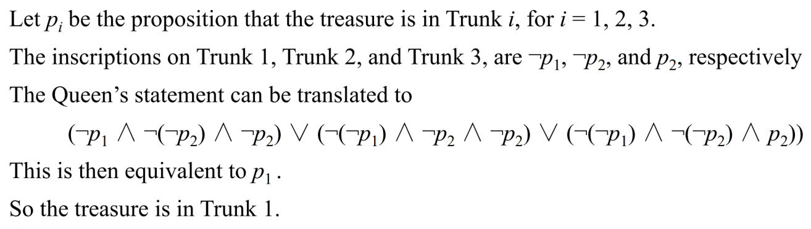
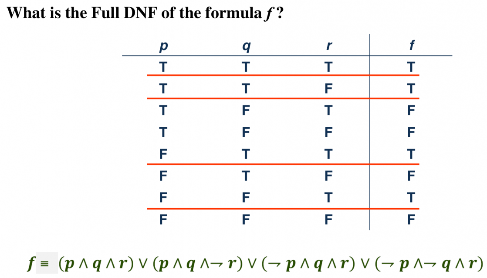
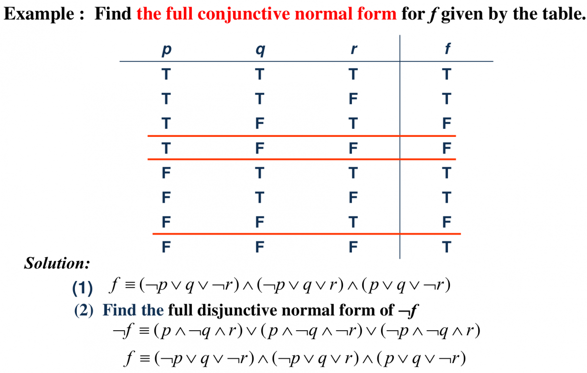
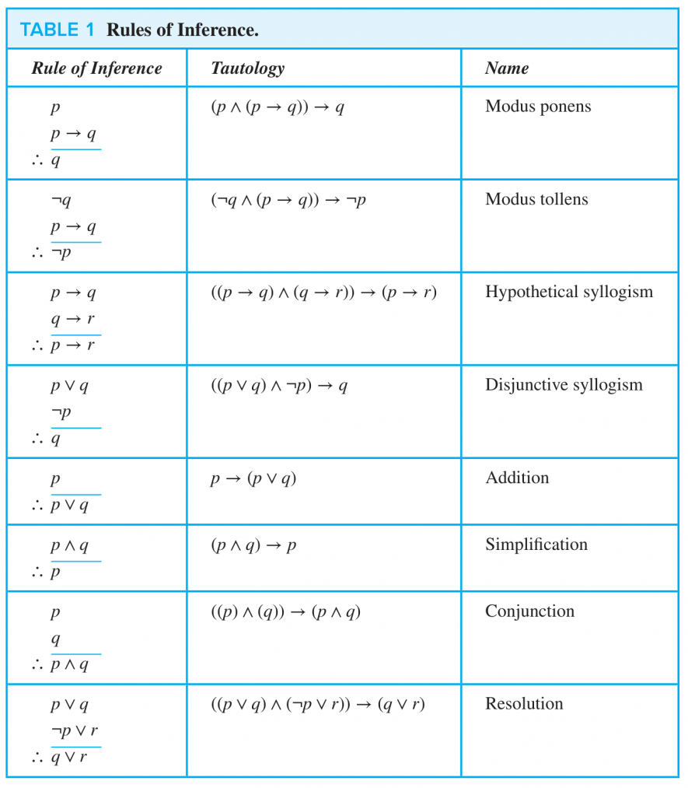
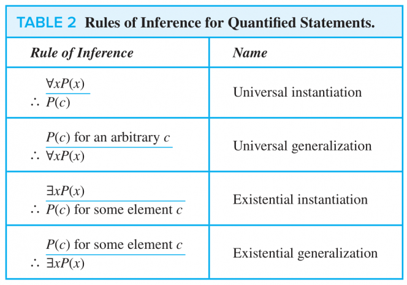

---
tags:
- logic
- proof
title: Ch1-Logic-and-Proofs
---
!!! abstract "摘要"
    本篇笔记介绍了命题逻辑的基本概念，包括命题、逻辑运算符、条件语句、真值表及其应用等内容。接着，讨论了逻辑等值式、逻辑定律、全功能集和标准式等重要主题。最后，笔记还涵盖了谓词逻辑、嵌套量词、推理准则和证明方法等内容，提供了对逻辑推理和证明的深入理解。<small>（由 gpt-4o-mini 生成摘要）</small>

    [! Word Table]
    -   **有理数(rational)**
    -   **反例(counterexample)**
    -   **前提(premise)**

## 1. 命题逻辑 Propositional Logic {#1-命题逻辑-propositional-logic}

### 1.1. 命题 Propositions {#11-命题-propositions}

**命题(proposition)**：A proposition is a **declarative sentence** that is either `true` or `false`, but not both.

-   **悖论(paradox)** 不属于命题,因为它的真值不稳定（e.g. _This statement is false._ or _I'm lying._）

**命题逻辑(propositional logic)**：The area of logic that deals with propositions.

**命题变量(propositional variable)**：**Small** letters such as $p,q,r,s,\ldots$ used to present propositions.

**真值(truth value)**：T (true proposition), or F (false proposition)

We call a series of propositions **consistent(一致的)** if they can possibly be satisfied at the same time.

??? info "How to prove one system is consistent, while not using truth values."
    ### 归结原理 / 消解法 (Resolution Principle) 

    1. 化为合取范式
    2.  **提取子句集 (Clauses)：** 把所有括号拆开，把它们当成一个集合。
    3.  **应用“归结规则 (Resolution Rule)”：**

 如果在集合中找到一个子句包含某个变量（比如 $p$），另一个子句包含它的否定（$\neg p$），就把它们**对撞抵消**，剩下的部分组合成一个新的子句。
 > *   *公式：* 拥有 $(p \vee A)$ 和 $(\neg p \vee B)$，可以推导出 $\to (A \vee B)$
> 4.  **一致性判定标准：**
>    *   如果你一路抵消，最后推出了一个**“空子句 (Empty Clause, 记为 $\square$ 或 $\bot$)”**（比如拿 $p$ 和 $\neg p$ 抵消，什么都没剩下），说明这组命题蕴含了绝对的矛盾，**是不一致的**,**因为空子句是永假的**。
    > *   如果你把所有能抵消的都抵消完了，**穷尽了所有可能的组合，依然没有推导出空子句**，那么严谨证明完毕：**这组命题是一致的 (Consistent)。**
>5.**当你已知一些命题为真时，可以通过反证法和归结原理来证明目标式正确**
    > ---
    > ### 其他方法
    > - **真值树法 / 解析树法 (Semantic Tableau / Truth Tree)**：本质上与归结原则相同，但更加直观，若树枝都封闭，则不一致
    > - **自然演绎 (Natural Deduction)**：数学方法，是否可以和哥德尔不完备定理结合？
    > - ** 模型构造法**（非欧几何）

### 1.2. 逻辑运算符 Logical Operators {#12-逻辑运算符-logical-operators}

**逻辑运算符(logical operator)** or **逻辑连接词(logical connective)**: be used to form compound propositions from existing propositions

| Connectives                        | Expression           | Note                                                              |
| ---------------------------------- | -------------------- | ----------------------------------------------------------------- |
| Negation (NOT)                     | $\lnot p$            |                                                                   |
| 和取 Conjunction (AND)               | $p \land q$          |                                                                   |
| 析取 Disjunction (OR)                | $p\lor q$            |                                                                   |
| 亦或 Exclusive Or (XOR)              | $p\oplus q$          | 1.p or q, but not both 2.exactly one of them is true           |
| 条件 Conditional (IF-THEN)           | $p\rightarrow q$     | the conditional statement is F only when p is true and q is false |
| 双条件 Biconditional (IF AND ONLY IF) | $p\leftrightarrow q$ | p and q have the same truth value                                 |
| 与非 NAND                            | $p\uparrow q$        | Sheffer Stroke                                                    |
| 或非  NOR                            | $p\downarrow q$      | Peirce Stroke                                                     |

-   英语中的单词 or 既可以表示 inclusive or 也可以表示 exclusive or（e.g. _George was born in 1956 or 1957._），取决于具体语境。

逻辑运算符的**优先级(precedence)** 如下：

|$($|$\lnot$|$\land$|$\lor$|$\rightarrow$|$\leftrightarrow$|
|---|---|---|---|---|---|
|0|1|2|3|4|5|
- Sheffer Stroke 和 Peirce Stroke通常需要加括号
### 1.3. 条件语句 Conditional Statements {#13-条件语句-conditional-statements}

**推断(implication)** or **条件语句(conditional statement)**：$p\rightarrow q$, false when $p$ is true and $q$ is false. $p$ 为假时推出什么都是真的，$p$ 为真时必须推出真的才为真。

注意 $p$ only if $q$

只有在 $q$ 成立的时候 $p$ 成立，即 $\lnot q \rightarrow \lnot p$，实际上等价于 $p\rightarrow q$。

More Equivalent Forms

-   If $p$, then $q$
-   $p$ implies $q$
-   If $p$, $q$
-   $q$ if $p$
-   $q$ when $p$
-  $p$ only if $q$
-   $q$ follows from $p$ (是...的必然结果)
-   $q$ whenever $p$
-   $p$ is a sufficient condition for $q$
-   $q$ is a necessary condition for $p$
-   $q$ unless $\lnot p$

-   **假设(hypothesis = antecedent = premise)**：$p$
-   **结论(conclusion = consequence)**: $q$

对于推断 $p\rightarrow q$ 我们可以定义以下条件语句：

-   **逆命题(converse)**：$q\rightarrow p$
-   **否命题(inverse)**：$\lnot p\rightarrow \lnot q$
-   **逆否命题(contrapositive)**：$\lnot q\rightarrow \lnot p$

逆否命题与原命题等价

The contrapositive has **the same truth values** as the original implication.

**双条件语句(biconditional statement)**：The biconditional statement $p\leftrightarrow q$ is the propostion “$p$ if and only if $q$.” The biconditonal statemnt

### 1.4. 真值表 Truth Table {#14-真值表-truth-table}

要学会画**真值表(truth table)**。

-   $n$ 个不同的布尔变量所画的真值表应有 $2^n$ 行。

例：$n$ 个不同的布尔变量可以构成多少个不等价的逻辑表达式？

可以从真值表的角度入手考虑，$n$ 个布尔变量有 $2^n$ 个取值，而这其中的每一个取值在代入逻辑表达式后都可以得到一个 $0$ 或 $1$，故共有 $2^{2^n}$ 种可能，也就是有 $2^{2^n}$ 种不同的逻辑表达式。

??? note "#### Fuzzy Logic(模糊逻辑)"
    1.  **合取 (AND / $\wedge$)：取最小值** $\to \min(A, B)$
    2.  **析取 (OR / $\vee$)：取最大值** $\to \max(A, B)$ 
    3. **否定(NOT/$\lnot$):用1减$\to$ 1-A**
    ---
    Q:原有的logic laws是否适用于fuzzy logic?(可以结合群论？)
    A:对于最常用的 **Zadeh 算子集**（由模糊逻辑创始人提出）定义如下：
    *   **与 (AND):** $\mu_{A \cap B}(x) = \min(\mu_A(x), \mu_B(x))$
    *   **或 (OR):** $\mu_{A \cup B}(x) = \max(\mu_A(x), \mu_B(x))$
    *   **非 (NOT):** $\mu_{\neg A}(x) = 1 - \mu_A(x)$
    -  通过算子化证明，排中律、矛盾律、互补律...不成立(其他自行证明即可)
    ---
    ##### 其他算子
    *   想要简单直观：用 **Zadeh (Min/Max)**。
    *   想要平滑过渡：用 **代数算子 (Product)**。
    *   想要严格约束：用 **卢卡西维茨算子**。
    * 或许0和1就是急剧算子
    ---
    ##### 模糊归结理论
    - 在模糊归结中，每个子句不再只是“真”或“假”，而是带有一个**真值 $T$**
    - 我们设定一个**可信度阈值 $\lambda$**（比如 $\lambda = 0.6$）*   只有当一个子句的真值**大于** $\lambda$ 时，我们才认为它是“够真”的，可以参与推理。
    - 若归结出空子句，可以认为推导出一个带有权重的矛盾
    *  推理的目标不是证明结果为 $0$（绝对矛盾），而是证明结果的真值**小于等于 $1-\lambda$**（即：在 $\lambda$ 的标准下，它已经足够假了）。

### 1.5. 命题逻辑的应用 Applications of Propositional Logic {#15-命题逻辑的应用-applications-of-propositional-logic}

#### 1.5.1. 翻译句子 Translating Sentences {#151-翻译句子-translating-sentences}

-   将英语句子翻译成逻辑表达式，来减少自然语言的**不准确(inaccuracy)** 和**模糊(ambiguous)**。

#### 1.5.2. 系统描述 System Specification {#152-系统描述-system-specification}

可以用于精确地描述系统需求、解决一些逻辑谜题等。

#### 1.5.3. 逻辑谜题 Logical Puzzles {#153-逻辑谜题-logical-puzzles}

例：宝箱谜题

As a reward for saving his daughter from pirates, the King has given you the opportunity to win a treasure hidden inside one of three trunks. The two trunks that do not hold the treasure are empty. To win, you must select the correct trunk. Trunks 1 and 2 are each inscribed with the message “This trunk is empty,” and Trunk 3 is inscribed with the message “The treasure is in Trunk 2.” The Queen, who never lies, tells you that only one of these inscriptions is true, while the other two are wrong. Which trunk should you select to win?

Answer

## 2. 逻辑等值式 Propositional Equivalences {#2-逻辑等值式-propositional-equivalences}

### 2.1. 导论 Introduction {#21-导论-introduction}

先定义以下基本概念：

-   **永真(tautology)**：A proposition which is always true. (e.g. $p \lor \lnot p$)
-   **永假(contradiction)**：A proposition which is always false. (e.g. $p \land \lnot p$)
-   **可能式(contingency)**：A proposition which is neither a tautology nor a contradiction. (e.g. $p$)

命题 $p$ 和 $q$ 是**逻辑等值(logically equivalent)** 的，当且仅当命题 $p\leftrightarrow q$ 是永真的。可被表示为：$p\Leftrightarrow q$ 或 $p\equiv q$。

-   一个复合命题是**可满足的(satisfiable)**：if there is an assignment of truth values to its variables that makes it true. 称这组赋值为该复合命题的解。
-   一个复合命题是**不可满足的(unsatisfiable)**：when it is false for all assignments of truth values to its variables.

### 2.2. 逻辑定律 Logical Laws {#22-逻辑定律-logical-laws}

-   可以用真值表来证明一些基本的逻辑定律：对于涉及到 $n$ 个变量的两个命题，画出 $2^n$ 种可能的变量取值下的真值表，若两个命题的值都相同则说明这两个命题是逻辑等值的。

| Name                       | Expression                                                               | Note                                                                           |
| -------------------------- | ------------------------------------------------------------------------ | ------------------------------------------------------------------------------ |
| 统一律 Identity Laws          | $p\land \text{T}\equiv p \quad\quad p\lor \text{F} \equiv p$             |                                                                                |
| 零一律 Domination Laws        | $p\lor \text{T}\equiv \text{T}\quad\quad p\land \text{F}\equiv \text{F}$ |                                                                                |
| 幂等律 Idempotent Laws        | $p\land p \equiv p \quad\quad p\lor p \equiv p$                          |                                                                                |
| 对合律 Double Negation Law    | $\lnot \lnot p \equiv p$                                                 |                                                                                |
| 交换律 Commutative Laws       | $p\lor q \equiv q \lor p\quad\quad p\land q\equiv q\land p$              |                                                                                |
| 结合律 Associative Laws       | $(p\lor q)\lor r\equiv p\lor (q\lor r)$                                  |                                                                                |
| 分配律 Distributive Laws      | $p\lor (q\land r)\equiv(p\lor q)\land (p\lor r)$                         |                                                                                |
| **德·摩根律 De Morgan's Laws** | $\lnot(p\lor q)\equiv \lnot p\land \lnot q$                              | **重要**                                                                         |
| 否定律 Negation Laws          | $p\lor \lnot p\equiv \text{T}\quad\quad p\land \lnot p\equiv \text{F}$   |                                                                                |
| 吸收律 Absorption Laws        | $p\lor (p\land q)\equiv p\quad\quad p\land (p\lor q) \equiv p$           | $p\lor (\lnot p\land q)\equiv p \lor q$$p\land (\lnot p\lor q)\equiv p\land q$ | | 逆否律 Contrapositive Law     | $p\rightarrow q \equiv \lnot q\rightarrow \lnot p$                       | 命题与它的逆否命题等价                                                                    | | **导出律 Exportation Law**    | $(p\land q)\rightarrow r\equiv p\rightarrow (q\rightarrow r)$            |                                                                                | | Absurdity Law              | $(p\rightarrow q)\land (p\rightarrow \lnot q)\equiv \lnot p$             |                                                                                | | **蕴含律 Implication Law**    | $p\rightarrow q \equiv \lnot p \lor q$                                   | 用于去掉箭头                                                                         | | Equivalence Law            | $p\leftrightarrow q\equiv (p\rightarrow q)\land (q\rightarrow p)$        |                                                                                |

### 2.3. 全功能集 Functionally Complete Collection of Logical Operators {#23-全功能集-functionally-complete-collection-of-logical-operators}

只需要部分运算符就可以表示出所有可能的运算，称这样的一个运算符集合为**全功能集(Functionally Complete Collection)**。

**极小全功能集**：$\{\lnot, \lor\}$, $\{\lnot, \land\}$, $\{|\}$, $\{\downarrow\}$ 等。

??? note "### How to prove one collection is FCC"
    #### 归约法（Substitution / Reduction）
    - 若给定集合可以表示已知FCC中的所有运算符，则给定集合为FCC
    #### 波斯特完备性定理（Post's Theorem）
    - **必须有运算符不符合**：保零性、保真性、线性、单调性、自我对偶性
    - [introduction from wiki](https://en.wikipedia.org/wiki/Post%27s_theorem)

### 2.4. 标准式 Propositional Normal Forms {#24-标准式-propositional-normal-forms}

#### 2.4.1. DNF/CNF {#241-dnfcnf}

先给出以下基本定义：

-   A **字面量(literal)** is a variable or its negation.
-   Conjunctions with literals as conjuncts are called **合取子句(conjunctive clauses)** (clauses). 通过 AND 连接起来的一组字面量。

**标准式(Propositional Normal Forms)** 有以下两种：

-   **析取范式(Disjunctive Normal Form, DNF)**：A formula is said to be in disjunctive normal form if it is written as a disjunction, in which all the terms are conjunctions of literals. (e.g. $(p\land q)\lor(p\land \lnot q)$.)
    -   最外面一层的运算符都是析取 $\lor$；
    -   括号内的运算符都是合取 $\land$；
    -   括号不能嵌套；
    -   $\lnot$ 只能出现在变量前。
-   **合取范式(Conjunctive Normal Form, CNF)**：和 DNF 的定义相反；把 $\land$ 和 $\lor$ 互换。

Theorem

Any formula $A$ is tautologically equivalent to **some** formula in DNF (CNF).

Proof

可以通过真值表构造，详见下面的 get the Full DNF of any formula 部分。

Construct the truth table for the proposition. Then an equivalent proposition is the disjunction with n disjuncts (where n is the number of rows for which the formula evaluates to T). Each disjunct has m conjuncts where m is the number of distinct propositional variables. Each conjunct includes the positive form of the propositional variable if the variable is assigned T in that row and the negated form if the variable is assigned F in that row. This proposition is in disjunctive normal from.

#### 2.4.2. Full DNF/CNF {#242-full-dnfcnf}

-   A **极小项(minterm)** is a conjunctive of literals in which each variable is represented exactly once.
-   A **极大项(maxterm)** is a disjunctive of literals in which each variable is represented exactly once.

可以从真值表中得到**主析取范式(Full Disjunctive Normal Form)**：

-   每个最小项对应真值表中 $f=\text{T}$ 的恰好一行。

利用 De Morgan's Laws，也可以从真值表中得到**主合取范式(Full Conjuctive Normal Form)**：

-   取出所有真值表为中为 $\text{F}$ 的位置，写出 $\lnot f$。
-   对 $\lnot f$ 应用 De Morgan's Laws，可以将式子中的合取析取互换，从而求得 FCNF。

## 3\. 谓词逻辑 Predicate Logic {#3-谓词逻辑-predicate-logic}

### 3.1. 谓词 Predicates {#31-谓词-predicates}

> 考虑 $x>0$，可以被表示为**命题函数(propositional function)** $P(x)$，这里 $P$ 表示 $\text{is greater than } 0$ 且 $x$ 是一个变量。

-   Propositional functions become propositions (and have truth values) when their variables are each replaced by a value from the domain or bound by a quantifier.
-   A statement of the form $P(x_1,x_2,\ldots, x_n)$ is the value of the propositional function P at the $n$\-tuple $(x_1,x_2,\ldots, x_n)$ and $P$ is called a $n$\-ary predicate.

我们可以用命题函数来描述**前提条件(preconditions)** 和**后置条件(postconditions)** ，这可以用于约束一段程序的输入和输出。

### 3.2. 量词 Quantifiers {#32-量词-quantifiers}

-   **全称量词(universal quantifier)** $\forall$：都是真才为真，存在一个为假就为假。可以转化为合取。
-   **存在量词(existential quantifier)** $\exists$：都是假才为假，存在一个为真就为真。可以转化为析取。
-   **唯一量词(uniqueless quantifier)** $\exists !$：有且仅有一个为真时才为真。

我们在使用量词时，可能只要求对于某一范围内的 $x$ 成立，我们把此时 $x$ 的取值范围称为 **讨论域(domain of discourse = universe of discourse)**，一般简写为 domain。

**量词的优先级(precedence of quantifiers)**

量词的优先级高于所有逻辑运算。The quantifiers $\forall$ and $\exists$ have higher precedence than all the logical operators.

所以平时我们再说，对于所有 $x$，满足 $p(x)$ 和 $q(x)$ 时可能会表示为 $\forall x p(x)\land q(x)$，但正确的做法应该是 $\forall x (p(x) \land q(x))$。

### 3.3. 谓词逻辑的等值 Equivalences in Predicate Logic {#33-谓词逻辑的等值-equivalences-in-predicate-logic}

Statements involving predicates and quantifiers are logically equivalent if and only if they have the same truth value no matter

-   代入了什么谓词选择 which predicates are substituted into these statements and
-   使用了什么讨论域 which domain of discourse is used for the variables in these propositional functions

同样使用 $\equiv$ 符号来表示谓词逻辑中的等值。

**德摩根定律(De Morgan’s laws)** 在谓词逻辑中也适用：

$\begin{aligned} \lnot \forall x P(x) &\equiv \exists x \lnot P(x)\\ \lnot \exists x P(x) &\equiv \forall x \lnot P(x) \end{aligned}$

只有在 $A(x)$ 和 $B(x)$ 都输出真时，$A(x) \land B(x)$ 才为真，此时第一个等式的两侧都为真，否则两侧都为假。类似的可以证明第二个等式。

$\begin{aligned} \forall x (A(x) \land B(x)) &\equiv \forall x A(x) \land \forall x B(x)\\ \exists x (A(x) \lor B(x)) &\equiv \exists x A(x) \lor \exists x B(x) \end{aligned}$

但是如果把上面的等式的 $\land$ 和 $\lor$ 互换则不成立。容易举出反例。

$\begin{aligned} \forall x (A(x) \lor B(x)) &\not\equiv \forall x A(x) \lor \forall x B(x)\\ \exists x (A(x) \land B(x)) &\not\equiv \exists x A(x) \land \exists x B(x) \end{aligned}$

但这两个命题在其中一个方向上是正确的。

$\begin{aligned} \forall x A(x) \lor \forall x B(x) &\Rightarrow \forall x (A(x) \lor B(x))\\ \exists x (A(x) \land B(x)) &\Rightarrow \exists x A(x) \land \exists x B(x)\\ \end{aligned}$

此外，还有：

$\begin{aligned} x \text{ is not occurring in } P.\\ \forall x A(x) \lor P &\equiv \forall x (A(x) \lor P)\\ \forall x A(x) \land P &\equiv \forall x (A(x) \land P)\\ \exists x A(x) \lor P &\equiv \exists x (A(x) \lor P)\\ \exists x A(x) \land P &\equiv \exists x (A(x) \land P)\\ \end{aligned}$

$\begin{aligned} x \text{ is not occurring in } B.\\ \forall x (B \rightarrow A(x)) &\equiv B \rightarrow \forall x A(x)\\ \exists x (B \rightarrow A(x)) &\equiv B \rightarrow \exists x A(x)\\ \forall x (A(x) \rightarrow B) &\equiv \exists x A(x) \rightarrow B\\ \exists x (A(x) \rightarrow B) &\equiv \forall x A(x) \rightarrow B\\ \end{aligned}$

## 4\. 嵌套量词 Nested Quantifiers {#4-嵌套量词-nested-quantifiers}

**嵌套量词(nested quantifier)**：出现在另一个量词的辖域下的量词。Nest quantifiers are quantfiers that occur within the scope of other quantifiers.

### 4.1. 量词的顺序 Order of Quantifiers {#41-量词的顺序-order-of-quantifiers}

除非所有量词都是 $\forall$ 或所有量词都是 $\exists$，否则量词的顺序是有意义的。The order of nested quantifiers _matters_ if quantifiers are of different types

E.g.:

-   $\forall x\ \exists y\ L(x,y)$：_Everybody loves somebody._
-   $\exists y\ \forall x\ L(x,y)$：_There is someone who is loved by everyone._

可以用循环来理解量词的顺序。

### 4.2. 前缀范式 Prenex Normal Form {#42-前缀范式-prenex-normal-form}

任意表达式都可以被转化为**前缀范式(prenex normal form)**。

如何得到 PNF？可以遵循一下步骤：

1.  消除所有的 $\rightarrow$ 和 $\leftrightarrow$。Eliminate all occurrences of $\rightarrow$ and $\leftrightarrow$ from the formula in question.
2.  向内移动否定符号，注意应用德摩根定律。Move all negations inward such that, in the end, negation only appear as part of literals.
3.  对变量进行重命名，确定不同部分的变量不会冲突。Standardize the variables a part (when necessary).
4.  最后，将所有量词移动到最前面。The prenex normal form can now be obtained by moving all quantifiers to the front of the formula.

## 5\. 推理准则 Rules of Inference {#5-推理准则-rules-of-inference}

-   An **论据(argument)** is a sequence of statements that end with a conclusion
-   By **有效的(valid)**, we mean the conclusion must follow from the truth of the preceding statements (premises)
-   We use **推理准则(rules of inference)** to construct valid arguments

!!! caution
    在结论前别忘了加 $\therefore$ 和一条横线，这才是标准格式。

!!! success "归结与共识"

> #### 1. 核心结论：或（$\lor$）与与（$\land$）可以互换吗？
> *   **理论上（对偶性）**：**可以**。基于布尔代数的对偶原理，所有逻辑规律在交换 $\lor / \land$ 并翻转 $0/1$ 后依然成立。
>     *   **归结原理（Resolution）**：**证伪**（找矛盾）
>     *   **隐含项寻找（Consensus）**：目标是**铺满**（找永真或化简）
> 
> #### 2. “空集”的逻辑定义
> 逻辑值的本质取决于运算的**单位元（Identity Element）**：
> *   **空子句（Empty Disjunction, $\lor$）= False (0)**
> *   **空项（Empty Conjunction, $\land$）= True (1)**
> 
> #### 3. 归结思想在“化简”中的双向应用
> 
>
>
> | 维度 | **CNF 化简 (POS)** | **DNF 化简 (SOP)** |
> | :--- | :--- | :--- |
> | **基础结构** | 括号间是“与”，括号内是“或” | 项之间是“或”，项内部是“与” |
> | **操作名称** | **归结原理 (Resolution)** | **共识定理 (Consensus)** |
> | **操作示例** | $(A \lor B) \land (\neg A \lor C) \Rightarrow$ 产出 $(B \lor C)$ | $(A \land B) \lor (\neg A \land C) \Rightarrow$ 产出 $(B \land C)$ |
> | **化简逻辑** | **删除多余规则**：若新子句已存在，利用吸收律删掉旧长子句。 | **删除冗余覆盖**：若新项已存在，说明它是重复覆盖，可删掉。 |
> | **物理意义** | 在真值表里圈“0” | 在真值表里圈“1” |
> 
> #### 4. 关键术语辨析
> *   **隐含项 (Implicant)**：【实体】
>     *   特指 DNF 中的一个“乘积项”。
>     *   只要这一项为真，整个函数就为真（它“覆盖”了函数的一部分）。
> *   **蕴含 (Implication / $\implies$)**：【关系】
>     *   描述一种逻辑推导方向。
>     *   在 CNF 归结中：$前提子句 \implies 归结子句$。
>     *   在 DNF 化简中：$隐含项 \implies 整个函数$。
> 
> **一句话记忆：**
CNF 归结是在找**破洞**（矛盾），DNF 归结是在找**地毯**（覆盖）；前者空了是**假**，后者空了是**真**。
## 6\. 证明 Proof {#6-证明-proof}

### 6.1. 一些术语 Some Terminology {#61-一些术语-some-terminology}

-   A **证明(proof)** is a valid argument that establishes the truth of a mathematical statement.
-   A **定理(theorem)** (or **命题(proposition)**/fact/result) is a statement that can be shown to be true.
    -   **公理(axioms)** (or **假设(postulates)**) are statements we assume to be true
-   A **引理(lemma)** is a less important theorem that is helpful in the proof of other results
-   A **推论(corollary)** is a theorem that can be established directly from a theorem that has been proved.
-   A **猜想(conjecture)** is a statement that is being proposed to be a true statement
    -   A conjecture becomes a theorem once it has been proved to be true.

### 6.2. 形式化证明 Formal Proofs {#62-形式化证明-formal-proofs}

**形式化证明(formal proof)** v.s. **非形式化证明(informal proof)**：

-   Formal Proofs：
    -   Can be extremely long;
    -   May be hard to follow.
-   Informal Proofs:
    -   Each step may involve multiple rules of inference;
    -   Steps may be skipped;
    -   The axioms being assumed and the rules of inference used are not explicitly stated.

### 6.3. 证明方法 Proof Methods {#63-证明方法-proof-methods}

#### 6.3.1. 直接证明法 Direct Proof {#631-直接证明法-direct-proof}

通过**直接证明法(direct proof)** 证明 $p\rightarrow q$ 的方法是：

-   通过**推理规则(rules of inference)**、公理、**逻辑恒等式(logical equivalences)** 等推出 $q$ 也为真。

其余的证明方法都是**间接证明法(indirect proof)**。

#### 6.3.2. 空证明和平凡证明 Vacuous and Trivial Proof {#632-空证明和平凡证明-vacuous-and-trivial-proof}

-   **空证明(vacuous proof)**：当 $p$ 为假时 $p\rightarrow q$ 为真，所以我们可以通过证明 $p$ 为假来证明 $p\rightarrow q$ 为真。
-   **平凡证明(trivial proof)**：当 $q$ 为真时 $p\rightarrow q$ 为真，所以我们也可以通过证明 $q$ 为真来证明 $p\rightarrow q$ 为真。

#### 6.3.3. 反证法 Proof by Contraposition {#633-反证法-proof-by-contraposition}

**反证法(proof by contraposition)** 可以看做对原命题的逆否命题的直接证明，根据逻辑恒等式：

$p\rightarrow q \equiv \lnot q\rightarrow \lnot p$

-   假设 $\lnot q$ 为真；
-   推出 $\lnot p$ 也为真（or 推出 $p$ 为假），从而证明原命题。

#### 6.3.4. 归谬证明法 Proof by Contradiciton {#634-归谬证明法-proof-by-contradiciton}

Proof $p$ by contradiction:

-   assumes $p$ is false.
-   deduces that $\lnot p \rightarrow (q \land \lnot q)$, which $q \land \lnot q$ is a contradiction.
-   $p$ follows from the above

Proof $p\rightarrow q$ by contradiction:

-   assumes that both $\lnot q$ and $p$ are true.
-   show that $(p \land \lnot q) \rightarrow \text{F}$.

注意区分 Proof by Contraposition 和 Proof by Contradiction

Proof by Contradiction 相比于 Proof by Contraposition 多假设了一个 $p$ is true，并且只需要最后将其归谬即可。

### 6.4. 证明策略 Proof Strategies {#64-证明策略-proof-strategies}

#### 6.4.1. 分类讨论 Proof by Cases {#641-分类讨论-proof-by-cases}

-   Convince the reader that the cases are inclusive (i.e. they exhaust all possibilities)
-   Establish all implications

#### 6.4.2. 穷举法 Exhausitve Proof {#642-穷举法-exhausitve-proof}

An **穷举法(exhaustive proof)** is a special type of proof by cases where each case involves checking a single example.

#### 6.4.3. 不失一般性地 Without Loss of Generality {#643-不失一般性地-without-loss-of-generality}

**不失一般性地(without loss of generality)**，常用于证明过程中，可以缩写为 WLOG。比如：我们想要证明 $|xy|=|x|\cdot |y|$，若已经证明了 $x\ge 0,\ y<0$ 的情况下成立，则可以不是一般性的得到 $x<0,\ y\ge 0$ 时也成立，因为这就是把 $x'=y,\ y'=x$ 代入后运用一次乘法交换律的情况。

合理运用 WLOG 可以帮助我们在分类讨论的过程中省略一些重复的证明，从而使证明过程更为简洁。

#### 6.4.4. 存在性证明 Existence Proof {#644-存在性证明-existence-proof}

-   **构造存在性证明(constructive existence proof)**：
    -   证明 $P(c)$ 对于定义域中的某一个 $c$ 成立。
    -   然后 $\exists x P(x)$ 就成立，根据**存在性推广规则(existential generalization = EG)**。
-   **非构造存在性证明(inconstructive existence proof)**：
    -   假设不存在 $c$ 使得 $P(c)$ 成立。
    -   然后推出一个矛盾，这可以说明原命题成立。

#### 6.4.5. 唯一性证明 Uniqueness Proof {#645-唯一性证明-uniqueness-proof}

**唯一性证明(uniqueness proof)** To show that a theorem assert the existence of a unique element with a particular property.

$\exists x (P(x) \land \forall y (y\neq x \rightarrow \lnot P(y)))$

唯一性证明可以分为证明其存在性和唯一性两部分。

-   **存在性(existence)**：We show that an element $x$ with the desired property exists.
-   **唯一性(uniqueness)**：We show that if $y\neq x$, then $y$ does not have the desired property. Equivalently, we can also show that if $x$ and $y$ both have the desired property, then $x=y$.
