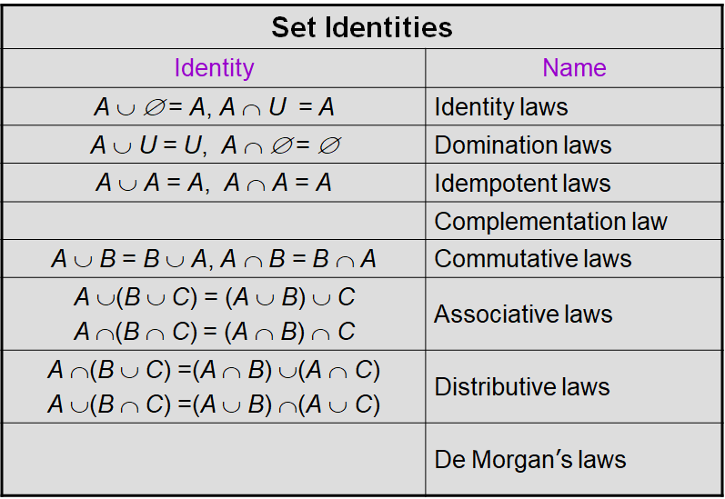
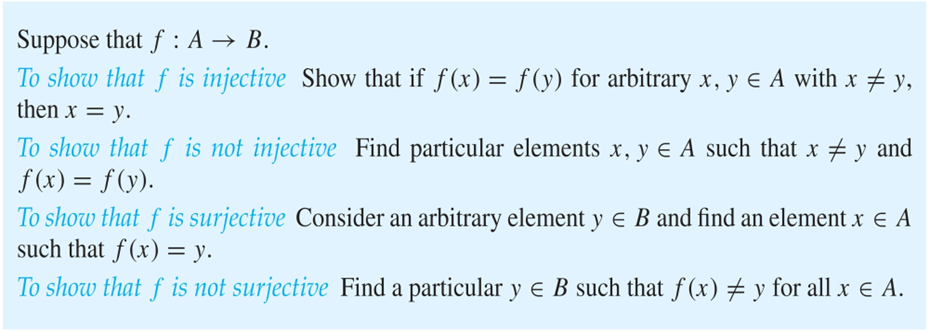
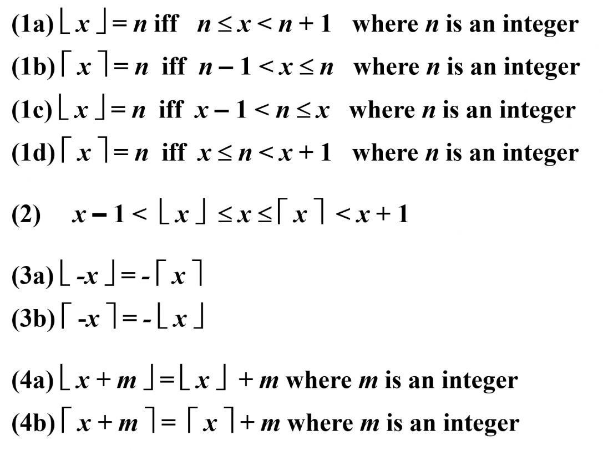
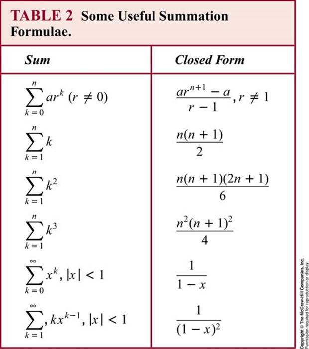
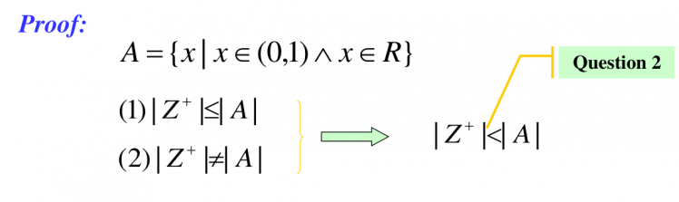
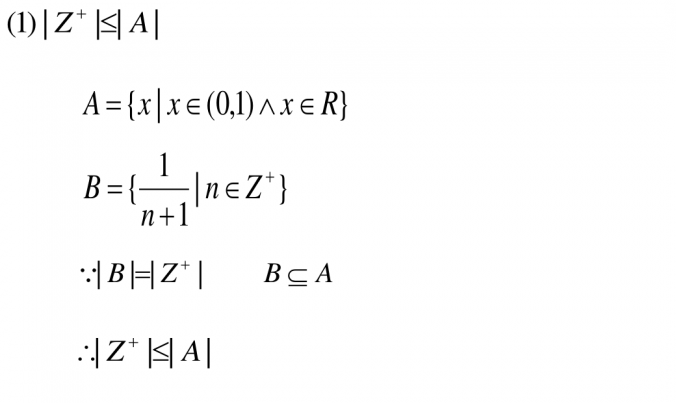
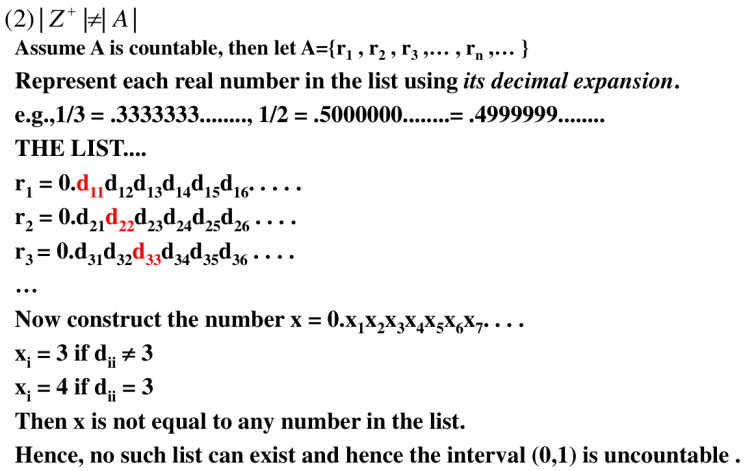
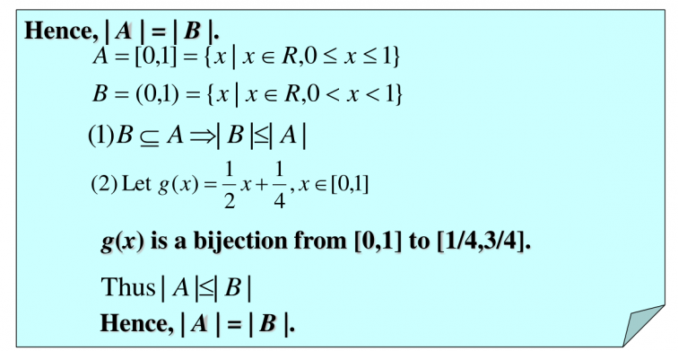
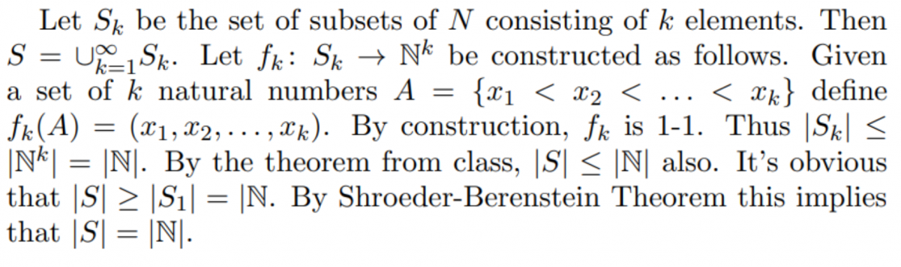

---
tags:
- set-theory
- function
title: Ch2-Basic-Structures
---
!!! quote
    **The essence of mathematics lies in its freedom.**
—— Georg Cantor

    [!abstract]
    ***The Art of Counting the Countless.***
    本篇笔记介绍了集合的基本概念，包括集合的定义、表示方法、集合之间的关系、集合的操作以及函数的基本性质。我们探讨了集合的基数、可数性以及康托定理等重要主题。通过这些内容，读者将能够理解离散数学中集合和函数的基本结构和性质。<small>（由 gpt-4o-mini 生成摘要）</small>

    [!Word Table]

    -   **符号(notation)**
    -   省略号(ellipse)
    -   括号(brace)

## 1\. 集合 Sets {#1-集合-sets}

### 1.1. 引言 Introduction {#11-引言-introduction}

**集合(set)**：A set is an unordered collection of objects.

-   The objects in a set are call the **元素(elements)**，or members, of the set.
-   A set is said to **包含(contain)** its elements.
    -   $a \in A$：$a$ is the member of the set $A$.
    -   $a \not\in A$：$a$ is not the member of the set $A$.
-   **空集(empty set)**：$\varnothing$.

集合的表示方式：The descriptions of a set

-   Roster method: listing all its members between braces, e.g. $S=\{1,3,5,7,9\}$.
-   Brace notation with ellipses: e.g. $S=\{1,2,\ldots,99\}$.
-   Specification using set builder: $S=\{x\mid P(x)\}$, which means $S$ contains all the elements from $U$ (**全集(universal set)**) which have the property $P$.
-   **维恩图(Venn diagrams)**

罗素悖论 Russell Paradox

Suppose there is a town with just one male barber; and that every man in the town keeps himself clean-shaven: some by shaving themselves, some by attending the barber. The barber obeys the following rule: he shaves all and only those men in town who do not shave themselves. Does the barber shave himself?

### 1.2. 集合之间的关系 Relations between Sets {#12-集合之间的关系-relations-between-sets}

#### 1.2.1. Subset {#121-subset}

$A\subseteq B$: $A$ is a **子集(subset)** of the set $B$.

$A \subseteq B \Leftrightarrow \forall x (x \in A \rightarrow x \in B)$

#### 1.2.2. Equal {#122-equal}

$A=B$: $A$ is **等于(equal)** to $B$.

$A=B \Leftrightarrow A \subseteq B \land B \subseteq A$

#### 1.2.3. Proper Subset {#123-proper-subset}

$A\subset B$: A is a **真子集(proper subset)** of the set $B$.

$A \subset B \Leftrightarrow A \subseteq B \land A \neq B \Leftrightarrow \forall x (x \in A \rightarrow x \in B) \land \exists (x \in B \land  x\not\in A)$

#### 1.2.4. The Size of Sets {#124-the-size-of-sets}

Let $S$ be a set. If there are exactly $n$ distinct elements in $S$ where $n$ is a nonnegative integer, we say that $S$ is a **有限集(finite set)** and that $n$ is the cardinality of $S$.

#### 1.2.5. Power Sets {#125-power-sets}

Given a set S, the **幂集(power set)** of S is the set of all subsets of the set S. $\mathcal{P}(x)$ denotes the power set of $S$.

证明：$\mathcal{P}(A) \in \mathcal{P}(B) \Rightarrow \mathcal{P}(A) \subseteq B$.

#### 1.2.6. Cartesian Products {#126-cartesian-products}

The **有序 $n$ 元组(ordered $n$\-tuple)** $(a_1,a_2,\cdots ,a_n)$ is the ordered collection that has $a_1$ as its first element, $a_2$ as its second element, … , and $a_n$ as its nth element.

$A_1,A_2,\cdots,A_n$ 的**笛卡尔积(cartesian product)** 定义为

$A_1 \times A_2 \times \cdots A_n = \{(a_1,a_2,\cdots,a_n) \mid a_i \in A_i \quad\text{for }i=1,2,\cdots n\}$

-   If $|A|=m,\ |B|=n$, then $|A\times B|=|B\times A|=mn$.
-   $A\times B\neq B\times A$
-   $A\times \varnothing = \varnothing \times A= \varnothing$

#### 1.2.7. Truth Sets of Quantifiers {#127-truth-sets-of-quantifiers}

Given a predicate $P$ and a domain $D$. The **真集(truth set)** of $P$ is $P$ is the set of elements $x$ in $D$ for which $P(x)$ is true. Namely, the power set of $P$ is $\{x \in D\mid P(x)\}$

### 1.3. 集合操作 Set Operations {#13-集合操作-set-operations}

#### 1.3.1. Union {#131-union}

$A\cup B = \{x \mid x \in A \lor x \in B\}$

#### 1.3.2. Intersection {#132-intersection}

$A\cap B = \{x \mid x \in A \land x\in B\}$

#### 1.3.3. Difference {#133-difference}

$A-B = \{x \mid x\in A \land x \not\in B\}$: The difference of $A$ and $B$.

#### 1.3.4. Complement {#134-complement}

$\overline{A} = \{x \mid x \not\in A \land x\in U\}$: $\overline{A}$ is the **补集(complement)** of the set $A$.

#### 1.3.5. Symmetric difference {#135-symmetric-difference}

$A\oplus B = (A\cup B) - (A\cap B)$

按出现与否统计的话就类似于异或操作。

### 1.4. 集合恒等式 Set Indentities {#14-集合恒等式-set-indentities}

更多**集合恒等式(set indentities)** 可以参考逻辑恒等式。

证明集合相等的一些方法 Ways to Prove Set Identities

-   将证明恒等式转化为证两次子集。Show that $A\subseteq B$ and that $B\subseteq A$.
-   转化为 set builder 的形式，然后用逻辑恒等式证明。Use logical equivalences to prove equivalent set definitions.
-   类似于真值表的做法。Use a membership table.
-   从已有的恒等式中推演。Use previously proven identities.

## 2\. 函数 Functions {#2-函数-functions}

### 2.1. 引言 Introduction {#21-引言-introduction}

Let $A$ and $B$ be _nonempty_ sets. A **函数(function)** (mapping or transformations) $f$ from $A$ to $B$:

$f:A\rightarrow B$

$\forall a (a \in A \rightarrow \exists ! b  (b \in B \land f(a) = b))$

-   $A$ is called the **定义域(domain)** of $f$
-   $B$ is called the **值域(codomain)** of $f$

If $f(a) = b$,

-   $b$ is called the image of $a$ under $f$.
-   $a$ is called a preimage of $b$.

Let $f$ be a function from the set $A$ to the set $B$. The **图(graph)** of the function $f$ is the _set_ of ordered pairs

$\{(a,b) \mid a \in A \land f(a) = b\}$

### 2.2. 单射与满射 One-to-One and Onto Functions {#22-单射与满射-one-to-one-and-onto-functions}

A function f is **单射函数(one-to-one function = injection)** (denoted 1-1), or **单射的(injective)** if

$\forall a \forall b (f(a) = f(b) \rightarrow a = b)$

A function $f$ from $A$ to $B$ is called **满射函数(onto function = surjection)**, or **满射的(surjective)** if

$\forall b \in B \exists a \in A (f(a) = b)$

The function f is a **一一对应的(one-to-one correspondence)**, or a **双射(bijection)**, if it is both _one-to-one_ and _onto_.

Showing that $f$ is one-to-one or onto

### 2.3. 反函数 Inverse Functions {#23-反函数-inverse-functions}

Let $f$ be a bijection from $A$ to $B$. Then the **反函数(inverse function)** of $f$, denoted as $f^{-1}$, is the function from $B$ to $A$ defined as

$f^{-1} (y) = x \text{ iff } f(x) = y$

-   函数 $f$ 的反函数存在当且仅当函数 $f$ 是双射函数。Function $f$ is **可逆的(invertible)** if and only if $f$ is bijective. No inverse function exists unless $f$ is a bijection.

### 2.4. 函数的复合 Compositions of Functions {#24-函数的复合-compositions-of-functions}

Let $g$ be a function from the set $A$ to the set $B$ and let $f$ be a function form the set $B$ to the set $C$. The composition of the functions $f$ and $g$ denoted by $f \circ g$ is defined by:

$f \circ g (a) = f(g(a))$

-   $f\circ g$ can’t be defined unless the range of $g$ is a subset of the domain of $f$.

### 2.5. 高斯函数 Floor and Ceiling Functions {#25-高斯函数-floor-and-ceiling-functions}

关于高斯函数的实用性质 Useful Properties of the Floor and Ceiling Functions

## 3\. 数列 Sequence {#3-数列-sequence}

### 3.1. 引言 Introduction {#31-引言-introduction}

A **数列(sequence)** is a function from a subset of the set of integers (usually either the set $\{0, 1, 2, \ldots\}$ or the set $\{1, 2, 3,\ldots\}$) to a set $S$. We use the notation $a_n$ to denote the image of the integer $n$. We call an a term of the sequence.

A **等比数列(geometric progression)** is a sequence of the form

$a,\ ar,\ ar^2,\ \ldots,\ ar^n$

where the initial term $a$ and the **公比(common ratio)** $r$ are real numbers.

An **等差数列(arithmetic progression)** is a sequence of the form

$a,\ a+d,\ a+2d\, \ldots,\ a+nd$

where the initial term $a$ and the **公差(common difference)** $d$ are real numbers.

### 3.2. 和式 Summations {#32-和式-summations}

$\sum_{s\in S} f(s)$

$S$: the subset of the domain of the function $f$

Some Useful Summation Formulae

## 4\. 集合的基数 Cardinality of Sets {#4-集合的基数-cardinality-of-sets}

### 4.1. 引言 Introduction {#41-引言-introduction}

-   The cardinality of a set $A$ is equal to the cardinality of a set $B$, denoted $| A | = | B |$, iff there exists a **bijection** from $A$ to $B$.
-   If there is an _injection_ from $A$ to $B$, the cardinality of $A$ is less than or the same as the cardinality of $B$ and we write $|A| \le |B|$. When $|A| \le |B|$ and $A$ and $B$ have different cardinality, we say that the cardinality of $A$ is less than the cardinality of $B$ and write $|A|<|B|$.

所以说，比较无限**集合的基数(cardinality of set)** 的大小最关键的步骤就在于找到一个集合 $S$ 到另一个集合 $T$ 的**单射**，如果这样的单射能够找到，就有 $|S|\le |T|$。

### 4.2. 可数的 Countable {#42-可数的-countable}

-   A set that is either **有限的(finite)** **or** has the same cardinality as the set of **positive integers** called **可数的(countable)**.
-   A set that is not countable is called **不可数的(uncountable)**.
-   When an infinite set $S$ is countable, we denote the cardinality of $S$ by $\aleph_0$ (**阿列夫零(aleph null)**).
-   If $|A| = | \mathbb{Z}_+ |$, the set $A$ is **可数无穷(countable infinite)**.
- 可数无穷对并集运算是封闭的

!!! note "**Cantor-Bernstein-Schröder 定理**"

若 $|A| \le |B|$ 且 $|B| \le |A|$，则 $|A| = |B|$

#### 正有理数集 $\mathbb{Q}_+$ 是可数的. {#正有理数集-mathbbq_-是可数的}

(1) $|\mathbb{Q}_+| \le |S|$：$x=p/ q \rightarrow (p,q)$

(2) $|S| = |\mathbb{Z}_+|$：沿着对角线取

!!! note "**Cantor 配对函数**"
     通常定义双射 $\pi: \mathbb{N} \times \mathbb{N} \to \mathbb{N}$ 如下：

$$\pi(k_1, k_2) = \frac{(k_1 + k_2)(k_1 + k_2 + 1)}{2} + k_2$$

> - 按照两数之和作为对角线进行计算
> ---
> - ***有限个可数集的笛卡尔积还是可数集***
>
> 假设 $A$ 和 $B$ 都是可数集。
>*   因为 $A$ 可数，所以存在单射 $f: A \to \mathbb{N}$。
>*   因为 $B$ 可数，所以存在单射 $g: B \to \mathbb{N}$。
>*   我们可以构造一个从 $A \times B$ 到 $\mathbb{N} \times \mathbb{N}$ 的单射：$h(a, b) = (f(a), g(b))$。
>*   再利用 **Cantor 配对函数** $\pi: \mathbb{N} \times \mathbb{N} \to \mathbb{N}$，复合之后得到：
    >
    >
    >$$\Phi(a, b) = \pi(f(a), g(b))$$
    >
    >
> *   由于 $\Phi$ 是一个从 $A \times B$ 到 $\mathbb{N}$ 的单射，根据定义，$A \times B$ 是可数的。

(3) $|\mathbb{Z}_+| \le |\mathbb{Q}_+|$：$x\rightarrow x/1$

#### $0$ 到 $1$ 之间的实数集是不可数的 {#0-到-1-之间的实数集是不可数的}

- 为什么图中提到 $1/2 = .500... = .499...$？
- 这是为了处理小数表示的不唯一性。有些数有两种写法，比如 $0.5$ 也可以写成 $0.4999\dots$。
为了防止构造出的 $x$ 因为这种重叠而恰好等于清单里的某个数，证明中特意选择了 **3 和 4** 这两个数字来构造 $x$。因为由 3 和 4 组成的无限小数不会出现“.000...”或“.999...”结尾的情况，从而避开了一数两写的陷阱，保证了证明的严密性。

#### $[0,1]$ 和 $(0,1)$ 是等势的。 {#01-和-01-是等势的}
- 实则，它们的基与全体实数的基也相等，这是整体等于部分的反直觉，可以构造正切函数证明

#### $\mathbb N$ 的所有有限子集是可数的（可以参考后面关于连续统假设的解释） {#mathbb-n-的所有有限子集是可数的可以参考后面关于连续统假设的解释}

先直接给出一种数数方法：
- 数集合的二进制表示，故可以证明$|R| = 2^{\aleph_0}$

再给出一个证明：

### 4.3. 康托定理 Cantor's Theorem {#43-康托定理-cantors-theorem}
双射衡量、无穷的对角线、幂集操作

The cardinality of the powerset of an arbitrary set has a greater cardinality than the original arbitrary set. 

??? success "证明不存在从 $A$ 到 $P(A)$ 的**双射**"
    **第一步：证明 $|A| \le |P(A)|$**
    这很容易。我们可以定义一个单射 $f(a) = \{a\}$，把每个元素映射到只包含它自己的集合里。这说明 $P(A)$ 至少和 $A$ 一样大。

    **第二步：证明 $|A| \neq |P(A)|$**
    我们假设存在一个**双射** $g: A \to P(A)$。
    这意味着 $A$ 里的每一个元素 $a$，都对应 $A$ 的一个子集 $g(a)$。而且 $P(A)$ 里的每一个子集，都被 $A$ 里的某个元素“认领”了。

    **第三步：构造“捣蛋鬼”集合 $S$**
    我们利用这种对应关系，构造一个非常特殊的子集 $S \subseteq A$：

    $$S = \{ a \in A \mid a \notin g(a) \}$$

    这个 $S$ 收集了所有那些“**不属于自己所对应的集合**”的元素。

    **第四步：逻辑崩溃（矛盾出现）**
    既然我们假设 $g$ 是双射（满射），那么这个子集 $S$ 一定会被 $A$ 中的某个元素 $x$ 认领。即：

    $$g(x) = S$$

    现在我们问一个问题：**$x$ 在不在 $S$ 里面？**

    1.  **如果 $x \in S$**：
        根据 $S$ 的定义，所有在 $S$ 里的元素都不属于它对应的集合。所以 $x \notin g(x)$。
        但 $g(x) = S$，所以结论是 $x \notin S$。——**矛盾！**

    2.  **如果 $x \notin S$**：
        既然 $x$ 不在 $S$ 里，而 $g(x)=S$，说明 $x \notin g(x)$。
        根据 $S$ 的定义，只要 $x \notin g(x)$，它就应该被放进 $S$ 里。所以结论是 $x \in S$。——**矛盾！**

你可以通过幂集来构造更大的无穷，这意味着**无穷有无穷个层级**，实际上有：$|\mathcal P(\aleph_k)| = |\aleph_{k+1}|$。

### 4.4.基数之间的关系 {#44基数之间的关系}

??? note "基数与集合之间的关系"

    ### 1. 包含关系 $\implies$ 大小不等式
    这是最直观的转化：**如果一个集合是另一个集合的子集，那么它的基数一定不大于另一个集合。**

    *   **集合关系**：$A \subseteq B$
    *   **基数转化**：$|A| \le |B|$
    *   **证明逻辑**：因为存在一个显然的单射 $f(x)=x$（包含映射），将 $A$ 中的每个元素映射到 $B$ 中。
    *   **例子**：因为 $\mathbb{Z}^+ \subseteq \mathbb{Q}_+$，所以 $|\mathbb{Z}^+| \le |\mathbb{Q}_+|$。

    ---

    ### 2. 映射关系 $\implies$ 相等、大于或小于
    当你无法直接观察包含关系时，需要通过**映射（函数）**来转化：

    *   **双射 (Bijection)**：存在一个一一对应的关系 $f: A \to B$。
        *   转化：**$|A| = |B|$**
        *   *这是定义基数相等的唯一标准。*
    *   **单射 (Injection)**：存在一个一对一的关系 $f: A \to B$（$B$ 可能有剩余）。
        *   转化：**$|A| \le |B|$**
    *   **满射 (Surjection)**：存在一个关系 $f: A \to B$，使得 $B$ 中每个点都被覆盖（$A$ 可能有多个点对应 $B$ 的同一个点）。
        *   转化：**$|A| \ge |B|$**

    ---

    ### 3. 集合运算 $\implies$ 基数算术
    集合的各种运算可以转化为类似数字的加减乘除：

    *   **并集 (Union)**：
        *   若 $A, B$ 不相交：$|A \cup B| = |A| + |B|$
        *   *注意：对于无限集，$\aleph_0 + \aleph_0 = \aleph_0$。*
    *   **笛卡尔积 (Cartesian Product)**：
        *   $|A \times B| = |A| \cdot |B|$
        *   *如你之前看到的，$\mathbb{Z}^+ \times \mathbb{Z}^+$ 的基数仍然是 $\aleph_0$。*
    *   **幂集 (Power Set)**：
        *   $P(A)$ 是 $A$ 的所有子集构成的集合。
        *   转化：**$|P(A)| = 2^{|A|}$**
        *   *康托尔定理证明了 $2^{|A|} > |A|$ 永远成立。*

    ---

    ### 4. Cantor-Bernstein-Schröder 定理
    这是在做证明题时**最常用**的转化技巧。当你很难直接构造一个复杂的双射时，你可以通过两次“包含”或“单射”来转化。

    *   **逻辑**：
        1. 证明 $|A| \le |B|$ （找到一个从 $A$ 到 $B$ 的单射）
        2. 证明 $|B| \le |A|$ （找到一个从 $B$ 到 $A$ 的单射）
    *   **结论**：**$|A| = |B|$**
    *   **用途**：你证明 $\mathbb{Q}_+$ 可数时，思路 (1) 和 (3) 实际上就是这个定理的应用。

    ---

    ### 5. 无限集
    处理无限集时，直觉有时会失效，必须严格按照映射转化：

    *   **真子集陷阱**：在有限集中，真子集的基数一定更小。但在无限集中，**真子集的基数可以等于原集**。
        *   例如：$偶数集 \subset 整数集$，但它们的基数相等（$|2\mathbb{Z}| = |\mathbb{Z}|$）。
    *   **加法陷阱**：给无限集增加有限个元素，基数不变。
        *   $|\mathbb{Z}^+ \cup \{0\}| = |\mathbb{Z}^+|$。

### 4.5.连续统假设 Continuum Hypothesis {#45连续统假设-continuum-hypothesis}
在集合论中，我们用 $\aleph$ 来表示无穷集合的基数：

*   **第一级（最小的无穷）：** 自然数集 $\mathbb{N}$、整数集 $\mathbb{Z}$、有理数集 $\mathbb{Q}$。它们的基数记作 **$\aleph_0$，因为无限集合的内部本身就存在自然数列
*   **第二级（连续统）：** 实数集 $\mathbb{R}$、区间 $(0,1)$。它们的基数记作 **$c$**（连续统，Continuum）或者 **$2^{\aleph_0}$
康托尔已经证明了 $c > \aleph_0$。那么是否存在一个集合 $S$，使得：

$$\aleph_0 < |S| < c$$

*   **连续统假设（CH）断言：** 实数集就是紧接着自然数集的“下一级”无穷大。如果用符号表示，就是 $c = \aleph_1$。
- **base的失效性**：底数的选择与无穷的大小是无关的，所有进制之间都存在双射，选择2是因为这符合是与不是的逻辑
- CH在目前看来，在ZFC公理体系下，既不可以被证明，也不可以被证伪，让我们思考ZFC是否完善和平行宇宙
