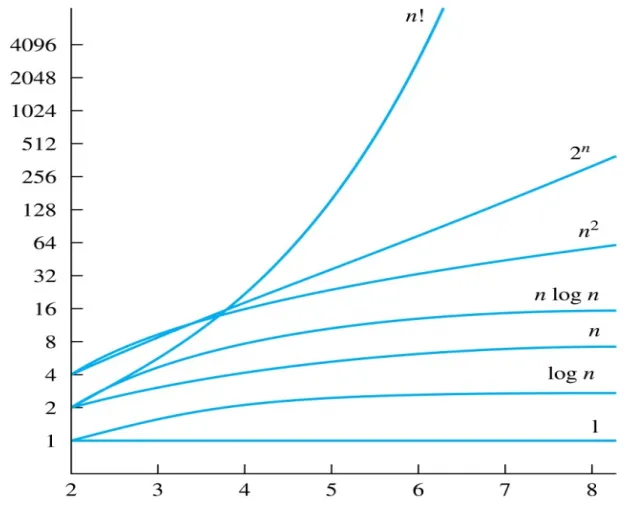

---
tags:
- algorithms
- computational-complexity-theory
- Turing-machine
title: Ch3-Algorithm
---
!!! abstract

    本篇笔记主要介绍了算法的基本概念，包括算法的定义、性质、函数的增长以及算法的复杂度等内容。通过对这些内容的深入探讨，读者将能够理解算法在计算机科学中的重要性，并掌握评估和分析算法性能的基本方法。<small>（由 gpt-4o-mini 生成摘要）</small>

## 1\. 算法 Algorithms {#1-算法-algorithms}

### 1.1. 导论 Introduction {#11-导论-introduction}

An **算法(algorithm)** is a finite set of precise instructions for performing a computation or for solving a problem.

### 1.2. 算法的性质 Properties of Algorithms {#12-算法的性质-properties-of-algorithms}

算法一般都有一些共同性质，在描述与评价算法时这种性质是常用的。

-   **输入(input)**：An algorithm has input values from a specified set.
-   **输出(output)**：From each set of input values, an algorithm produces output values from a specified set.
-   **确定性(definiteness)**：算法的每一步都应该被精确定义。The steps of an algorithm must be defined precisely.
-   **正确性(correctness)**：算法应该给出正确的输出结果。An algorithm should produce the correct output values for each set of input values.
-   **有限性(finiteness)**：算法应当在有限步内结束。An algorithm should produce the desired output after a finite number of steps for any input in the set.
-   **有效性(effectiveness)**：算法的每一步都可以被有效执行。Each step of an algorithm must be executed exactly and in a finite amount of time.
-   **通用性(generality)**：我们的算法应该对于任意符合条件的输入都应用，而不是只适用某些特定的输入。The procedure should be applicable for all problems of the desired form, not just for a particular set of input values.

correctness 和 effectiveness 辨析 ★

correctness 主要将算法应该给出 correct output values，而 effectiveness 则主要指出算法应当是可以被 exactly execute。作业题中有一题是一算法会出现 $1/0$ 的情况，应该判定为缺少 effectiveness.

## 2\. 函数的增长 The Growth of Functions {#2-函数的增长-the-growth-of-functions}

### 2.1. 渐进运行时间 Asymptotic Running Time {#21-渐进运行时间-asymptotic-running-time}

**渐进运行时间(asymptotic running time)** is the number of operations used by the algorithm as the input size approaches infinity.

### 2.2. 记号 Notations {#22-记号-notations}

**大 O 记号(Big-O notation)**：Let $f$ and $g$ be functions from $Z$ (or $R$) to $R$. We say that “$f(x)$ is $O(g(x))$” if there are constants $C$ and $k$ such that $|f(x)| \le C|g(x)|$ whenever $x>k$.

**大$\Omega$记号(Big-Omega notation)**：Let $f$ and $g$ be functions from $Z$ (or $R$) to $R$. We say that “$f(x)$ is $\Omega(g(x))$” if there are constants $C$ and $k$ such that $|f(x)|\ge C|g(x)|$ whenever $x>k$.

**大$\Theta$记号(Big-Theta notation)**：Let $f$ and $g$ be functions from $Z$ (or $R$) to $R$. We say that “$f(x)$ is $\Theta(g(x))$” if “$f(x)$ is $O(g(x))$” and “$f(x)$ is $\Omega(g(x))$”, i.e., there are constants $C_1$, $C_2$, and $k$ such that $0\le C_1 g(x) \le f(x) \le C_2 g(x)$ whenever $x>k$.

## 3\. 算法的复杂度 Complexity of Algorithms {#3-算法的复杂度-complexity-of-algorithms}

Commonly used Terminology for the Complexity of Algorithms

| Complexity         | Terminology                             |
| ------------------ | --------------------------------------- |
| $\Theta(1)$        | **常数复杂度(constant complexity)**          |
| $\Theta(\log n)$   | **对数复杂度(logarithmic complexity)**       |
| $\Theta(n)$        | **线性复杂度(linear complexity)**            |
| $\Theta(n \log n)$ | $\log(n!) = O(n \log n)$                |
| $\Theta(n^b)$      | **多项式复杂度(polynomial complexity)**       |
| $\Theta(b^n)$      | **指数复杂度(exponential complexity)** (b>1) |
| $\Theta(n!)$       | **阶乘复杂度(factorial complexity)**         |

!!! success
    更详细的的内容可见FDS-ZJU中的笔记[算法分析基础](../../FDS-ZJU/notes/%E7%AE%97%E6%B3%95%E5%88%86%E6%9E%90%E5%9F%BA%E7%A1%80.md)

## 4.优化问题 Optimization Problem {#4优化问题-optimization-problem}

### Definition {#definition}
- The goal of such problems is to find a solution to the given problem that either minimizes or maximizes the value of some parameter.

### Greedy Algorithms {#greedy-algorithms}
- Algorithms that make what seems to be “best” choice at each step are called greedy algorithms.
- **Shortest Path Problems** 
- Huffman Coding
- Minimum Spanning Tree
- Activity Selection

## 5.停机问题 Halting Problem {#5停机问题-halting-problem}
### 5.1. 问题的定义 {#51-问题的定义}

**停机问题描述如下：**
能否编写一个通用的程序（我们称之为 $H$），它可以分析**任意**一段程序代码（$P$）及其输入（$I$），并在有限的时间内告诉我们：这个程序 $P$ 在处理输入 $I$ 时，是会**运行结束（停机）**，还是会**陷入死循环**？

*   如果程序会结束，输出“停机”。
*   如果程序会死循环，输出“死循环”。

### 5.2.不可判定性 {#52不可判定性}

图灵通过逻辑证明得出：**这样的通用程序 $H$ 是不存在的。**

这意味着停机问题是**不可判定（Undecidable）**的。无论计算机性能多强，无论算法多先进，我们都无法编写出一个能完美预测**所有**程序是否会停机的程序。

### 5.3. 证明思路 {#53-证明思路}
图灵的证明非常巧妙，使用了类似“悖论”的逻辑。

1.  **假设**我们真的发明了一个能解决停机问题的程序，叫 `TrueOracle(program, input)`。
    *   如果 `program` 会停机，它返回 `True`。
    *   如果 `program` 会死循环，它返回 `False`。

2.  **构造一个怪异的程序**，我们叫它 `Evil(program)`：
    *   在这个程序内部，它先调用 `TrueOracle(program, program)`。
    *   **如果** `TrueOracle` 说这个程序会停机，那么 `Evil` 就故意进入一个**死循环**。
    *   **如果** `TrueOracle` 说这个程序会死循环，那么 `Evil` 就立刻**停止运行**。

3.  **终极悖论**：如果我们把 `Evil` 程序自己作为输入传给 `Evil` 呢？即运行 `Evil(Evil)`。
    *   **情况 A**：如果 `TrueOracle` 预测 `Evil` 会**停机** $\rightarrow$ 根据逻辑，`Evil` 会进入**死循环**。
        *   （矛盾：预测停机，结果死循环）
    *   **情况 B**：如果 `TrueOracle` 预测 `Evil` 会**死循环** $\rightarrow$ 根据逻辑，`Evil` 会立刻**停机**。
        *   （矛盾：预测死循环，结果停机）

### 5.4. 为什么要关注停机问题？ {#54-为什么要关注停机问题}

1.  有些逻辑真理是计算机无法触及的。
2.  **编译器的局限性**：编译器只能发现一些显而易见的死循环。
3.  没有任何一个算法可以处理所有可能的输入（包括它自己本身），并给出一个始终正确的答案。
4.  停机问题是数学逻辑中“哥德尔不完备定理”在计算机科学中的体现，证明了逻辑系统内存在既不能被证明也不能被证伪的命题，这个命题存在**自指和否定**

## 6.计算复杂度理论 {#6计算复杂度理论}

### 6.1 Sovable {#61-sovable}
- 存在一个算法，可以在有限时间内对该问题的所有输入给出正确答案
- 图灵证明了停机问题是不可解的，这是计算机能力的边界。所以若一个问题可以归约到停机问题，那么它一定是不可解的

### 6.3 Tractable 易处理性 {#63-tractable-易处理性}
- **class $P$**: 可以在多项式时间内解决，即最坏情况复杂度为 $O(n^k)$ 

- **Intractable**: 虽然可以解，但不存在多项式时间算法。其复杂度通常是**指数级（Exponential）**或更糟，如 $O(2^n)$ 或 $O(n!)$  

- **class $NP$**：我们可以在多项式时间内**验证**这个答案对不对 （包括P）

- **P = NP?** 如果有人能证明 所有NP 问题都是 Tractable 的，现代密码学将瞬间崩溃  

- **$NP$-complete**: NP问题中最难的问题，若是解出任意的一个，所有NP问题都可解

- **$NP$-hard**:至少和$NP$-complete一样难，它可能不属于NP问题

#### 6.4 SAT 可满足性问题 {#64-sat-可满足性问题}

它是第一个$NP$-complete问题：对于一个布尔表达式，找到所有布尔变量的赋值，使表达式的值为true

Q:我们可以化为DNF来解决SAT? 
A：实则在通过分配率化为DNF时，考虑最坏情况CNF，其复杂度是指数级的

!!! proof
    我们有两种图灵机，DTM(普通)，NTM(非确定性图灵机)。NTM可以在无数个路径中找到并验证正确的那个，即NTM是NP的数学化身。因为NTM的计算过程可以用布尔表达式模拟，而NTM可解所有的$NP$问，故SAT是$NP$-complete。
