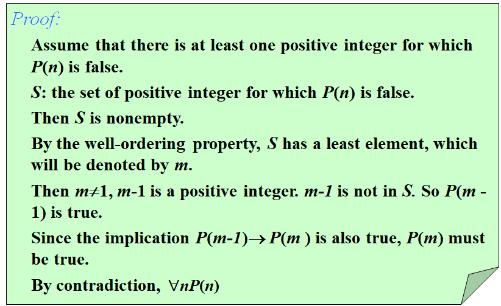

!!! abstract
    本篇笔记主要介绍了数学归纳法、完全归纳法和结构归纳法的基本概念及其应用，强调了归纳法在证明数学命题中的重要性，并探讨了递归定义与归纳法之间的关系。<small>（由 gpt-4o-mini 生成摘要）</small>

    [!Word Table]

    - **演绎(deduce)**
    - **多边形(polygon)**
    - **顶点(vertex)**
    - **凸多边形(convex)**
    - **凹多边形(nonconvex/concave)**
    - **对角线(diagonal)**
    - **三角剖分(triangulation)**

## 1\. 数学归纳法 Mathematical Induction {#1-数学归纳法-mathematical-induction}

### 1.1. 导论 Introduction {#11-导论-introduction}

**数学归纳法(mathematical induction)** is used to prove propositions of form $\forall n\ P(n)$ where the domain of discourse is the set of positive integers:

$P(n_0) \land \forall k\ge n_0 (P(k)\rightarrow P(k+1)) \rightarrow \forall n\ge n_0 (P(n))$

更一般的证明过程 More general form of the proof procedure

(1) **Basis step**: Establish $P(b)$

(2) **Inductive step**: Prove that $P(k)\rightarrow P(k+1)$ for $k\ge b$.

**Conclusion**: The basis step and the inductive step together imply $\forall n\ge b (P(n))$.

### 1.2. 数学归纳法的证明 Proof of Mathematical Induction {#12-数学归纳法的证明-proof-of-mathematical-induction}

**良序性(the well-ordering property)**：Every non-empty set of non-negative integers has a least element.(开区间无良序性)

!!! example "Proofs using the well-ordering property"
    Use the well-ordering property to prove the division algorithm. The division algorithm states >that if $a$ is an integer and $d$ is a positive integer, then there are unique integers $q$ and $r$, with $0\le r<d$ such that $a = dq + r$.

    [!answer]-  Answer
     完整的证明思路：
    第一部分：存在性 (Existence)

    **1. 构造一个集合 $S$：**
    我们定义一个由所有形如 $a - dx$ 的**非负整数**组成的集合：

    $$S = \{ a - dx \mid x \in \mathbb{Z} \text{ 且 } a - dx \ge 0 \}$$

    **2. 证明 $S$ 是非空集合：**
    要使用良序性质，首先必须证明 $S$ 不是空集。
    *   如果 $a \ge 0$：我们可以取 $x = 0$，则 $a - d(0) = a \ge 0$。因此 $a \in S$。
    *   如果 $a < 0$：我们可以取 $x = a$。因为 $d$ 是正整数（$d \ge 1$），则 $da \le a$（注意 $a$ 是负数，乘以大于等于1的数会变得更小或相等）。所以 $a - da = a(1 - d) \ge 0$。因此 $a(1-d) \in S$。
    综上所述，无论 $a$ 是多少，$S$ 中至少有一个元素。

    **3. 应用良序性质：**
    根据**良序性质**，正整数集的任何非空子集（这里是 $S$）一定有一个**最小元素**。
    我们把这个最小元素记作 **$r$**。

    **4. 确定 $q$ 和 $r$ 的关系：**
    因为 $r \in S$，根据 $S$ 的定义：
    *   $r \ge 0$
    *   存在某个整数 $q$，使得 $r = a - dq$。整理得：**$a = dq + r$**。

    **5. 证明 $r < d$：**
    （这里使用反证法）假设 $r \ge d$。
    考虑一个新数 $r' = r - d$。
    *   将 $r = a - dq$ 代入：$r' = (a - dq) - d = a - d(q + 1)$。
    *   因为我们假设 $r \ge d$，所以 $r' = r - d \ge 0$。
    *   这说明 $r'$ 也符合集合 $S$ 的定义，所以 $r' \in S$。
    *   但是，由于 $d > 0$，显然有 $r' = r - d < r$。
    *   这与“$r$ 是 $S$ 中最小元素”的结论相**矛盾**。
    *   因此，假设不成立，必须有 **$r < d$**。

    至此，存在性得证。

    ---

    #### 第二部分：唯一性 (Uniqueness)

    假设存在两组解 $(q, r)$ 和 $(q', r')$ 同时满足条件：
    1.  $a = dq + r \quad (0 \le r < d)$
    2.  $a = dq' + r' \quad (0 \le r' < d)$

    我们将两个等式相减：

    $$dq + r = dq' + r'$$

    $$d(q - q') = r' - r$$

    这意味着 $r' - r$ 必须是 $d$ 的倍数。
    现在观察 $r$ 和 $r'$ 的范围：
    因为 $0 \le r < d$ 且 $0 \le r' < d$，那么它们之间的差 $r' - r$ 的取值范围只能在 $-(d-1)$ 到 $(d-1)$ 之间，即：

    $$-d < r' - r < d$$

    在 $(-d, d)$ 这个区间内，**唯一的 $d$ 的倍数就是 0**。
    因此，必须有：

    $$r' - r = 0 \implies r' = r$$

    将其代回方程 $d(q - q') = r' - r$：

    $$d(q - q') = 0$$

    因为 $d > 0$，所以必须有：

    $$q - q' = 0 \implies q = q'$$

    至此，唯一性得证。

The **有效性(validity)** of mathematical induction follows from the well-ordering property for the set of positive integers ($\mathbb{Z}_+$).

## 2\. 完全归纳法 Strong Induction {#2-完全归纳法-strong-induction}

### 2.1. 导论 Introduction {#21-导论-introduction}

**完全归纳法(strong induction)** or **第二数学归纳法(second principle of mathematical induction)**：

$P(n_0) \land \forall k\ge n_0 (P(n_0) \land P(n_0+1) \land \cdots \land P(k) \rightarrow P(k+1)) \rightarrow \forall n\ge n_0 (P(n))$

更一般的证明过程 More general form of the proof procedure

(1) **Basis step**: Establish $P(n_0)$

(2) **Inductive step**: Prove $P(n_0) \land P(n_0 + 1) \land \cdots \land P(k) \rightarrow P(k+1)$

**Conclusion**: The basis step sand the inductive step allow one to conclude that $\forall n\ge n_0 P(n)$.

Note:

The validities of both mathematical induction and strong induction follow from the well-ordering property. In fact, mathematical induction, strong induction, and well-ordering are all equivalent principles.

### 2.2. Usages in Computational Geometry {#22-usages-in-computational-geometry}

Some Geometry Terms

-   **多边形(polygon)**、**边(side)**、**顶点(vertex)**
-   **简单多边形(simple polygon)**：简单多边形没有边相交。Every simple polygon divides the plane into two regions: its **内部(interior)**, its **外部(exterior)**.
-   **对角线(diagonal)**：连接任意两个非相邻节点的线段。
-   **内对角线(interior diagonal)**：完全在简单多边形内部的对角线。
-   **凸多边形(convex)**：凸多边形中的所有对角线均不边相交。或者说，凸多边形一定是简单多边形且所有对角线都是内对角线。
-   **三角剖分(triangulation)**：将多边形划分成若干个不重叠的三角形。

!!! success "Jordan Curve Theorem"

## 3\. 结构归纳法 Structural Induction {#3-结构归纳法-structural-induction}

**递归(recursion)** is a principle closely related to mathematical induction. In a **递归定义(recursive definition)**, an object is defined in terms of itself.

Sequences, functions and sets that defined recursively is **良定义的(well-defined)**.

**结构归纳法(structural induction)** 可以用于递归定义的对象（如树、图）的归纳证明，与数学归纳法有一定相似，但更强调结构的递归性质：

-   Basis Step: Show that the result holds for all elements specified in the basis step of the recursive definition to be in the set.
-   Recursive Step: Show that if the statement is true for each of the elements used to construct new elements in the recursive step of the definition, the result holds for these new elements.
