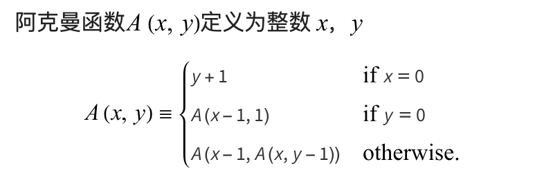

### Equivalence Relations {#equivalence-relations}
- A relation $R$ is defined on a set $S$ if for every pair of elements $(a, b)$, $a$,$b$ $\in S$, $a$ $R$ $b$ is either true or false.  If $a$ $R$ $b$ is true, then we say that $a$ is related to $b$.
- A relation, ~, over a set, $S$, is said to be an equivalence relation over $S$ iff it is symmetric, reflexive, and transitive over $S$.
- Two members $x$ and $y$ of a set $S$ are said to be in the same equivalence class $iff$ $x$ ~ $y$.

---
### Basic Data Structure {#basic-data-structure}
- 并查集（disjoint set）是一种数据结构，支持两种操作：
    - 合并两个集合（Union）
    - 查询两个元素是否属于同一个集合(Find)
- 用树（森林）的方式表示连接情况，一棵树表示一个集合
    - 合并则将一棵树的根节点作为另一棵树的根节点的儿子
    - 查询是否属于同一个集合则判断两个元素的根节点是否相同
- 用数组记录即可，例如 $S[i]$ 值表示 $i$ 这个节点的父节点
- 查找：依次根据数组值向上递归查找根节点即可
- 合并：先查找两个元素的根节点，然后将其中一个根节点的父节点设置为另一个根节点即可 
- worst case :$T(N) = O(N^2)$，即退化成斜树

!!! important
    指针由子节点指向父节点，因为： 
    1.便于Find和Union操作
    2.每个节点只需要一个指针

```c
#include <stdio.h>
#include <stdlib.h>

#define MAXN 1000  // 根据需求定义最大元素个数
int S[MAXN];       // 并查集数组

// 1. 初始化：每个元素都是一棵树，规模为 1 (记作 -1)
void Initialize(int N) {
    for (int i = 0; i < N; i++) {
        S[i] = -1; 
    }
}
```
---

### Smart Union Algorithms {#smart-union-algorithms}

#### Union-by-Size {#union-by-size}

- 数组中根节点对应的值的绝对值为其子节点的个数（初始-1），按大小合并，始终将小的树合并到大的树上，这样可以减少树的高度


!!! lemma
    一棵通过“按大小合并”生成的含有 $N$ 个节点的树，其高度 $height(T)$ 最大不会超过 $\lfloor \log_2 N \rfloor + 1$

    !!! proof
        **每当高度增加 1，该节点所属的树的总节点数至少翻倍**
        既然总共只有 $N$ 个节点，节点数最多只能翻倍 $\log_2 N$ 次。所以高度被限制在了 $O(\log N)$


     对于 $N$ 次 Union 和 $M$ 次 Find，总时间复杂度为 **$O(N + M \log N)$**


```c
void Union(int Root1, int Root2) {
    // 必须确保传入的是根节点，通常在调用前先做 Find
    if (Root1 == Root2) return;

    // S[Root] 是负数，值越小说明规模越大
    if (S[Root2] < S[Root1]) { 
        // Root2 更大：将 Root1 合并到 Root2
        S[Root2] += S[Root1]; // 更新新根的大小
        S[Root1] = Root2;     // 挂接
    } else {
        // Root1 更大或相等：将 Root2 合并到 Root1
        S[Root1] += S[Root2];
        S[Root2] = Root1;
    }
}

```
#### Union-by-Height {#union-by-height}
- 有时也叫按秩合并 (Union-by-Rank）,始终让较**矮**的树连接到较**高**的树下面
- 也能保证 $height(T)$ 最大不会超过 $\lfloor \log_2 N \rfloor + 1$

```c
// 按秩合并的 Union 函数
void UnionByRank(int Root1, int Root2) {
    if (Root1 == Root2) return;

    if (S[Root2] < S[Root1]) { 
        // Root2 更深：Root1 挂在 Root2 下，Rank 不变
        S[Root1] = Root2;
    } else {
        // Root1 更深或一样深
        if (S[Root1] == S[Root2]) {
            S[Root1]--; // 只有高度一样时，合并后高度才加 1 (负值减 1)
        }
        S[Root2] = Root1;
    }
}
```

---

### Path Compression {#path-compression}

在查找的同时将路径上的所有节点的父节点都设置为根节点，这样可以减少树的高度
```c
//负值法
// 复杂度：几乎 O(1)
int Find(int X) {
    if (S[X] < 0) {
        return X; 
    } else {
        return S[X] = Find(S[X]); 
    }
}
```

```c
//自环法
int find(int x) { 
    return ufs[x] == x ? x : ufs[x] = find(ufs[x]);
} 
```

---
### Worst Case for {#worst-case-for}


!!! def "Ackermann Function"
    
    - 它的增长速度甚至比指数和多指数函数快
    - 反阿克曼函数$\alpha(x,y)$即为阿克曼函数的反函数，所以它的增长速度极慢
    - 


$$\alpha(M, N) = \min \{ i \ge 1 \mid A(i, \lfloor M/N \rfloor) > \log N \} \le O(log^* N) \le 4 $$


 > - $log^*N =$of times the logarithm is applied to N until the result $\le$ 1.
 > [mathworld](https://mathworld.wolfram.com/AckermannFunction.html)


!!! lemma "Tarjan"
    Let $T( M, N )$ be the maximum time required to process an intermixed sequence of$M \ge N$finds and $N - 1$ unions.  
    Then:  

> 
> 
> $$k_1M \alpha( M, N ) \le T( M, N ) \le k_2M \alpha ( M, N ) $$
> 
> 
 for some positive constants k1 and k2 .
 > so: the worst case for path compression and union by rank(or size) is $O(\alpha(N))$
